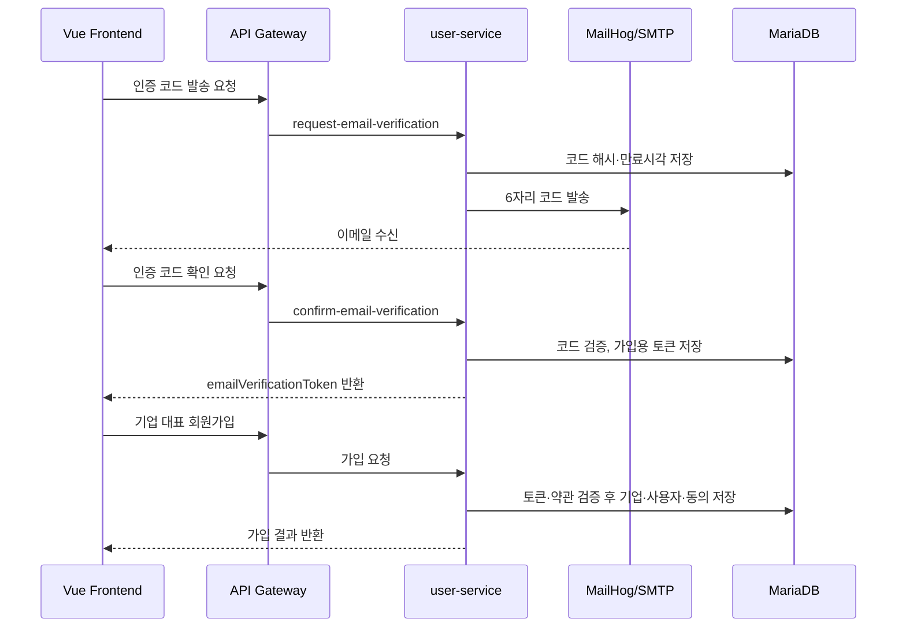
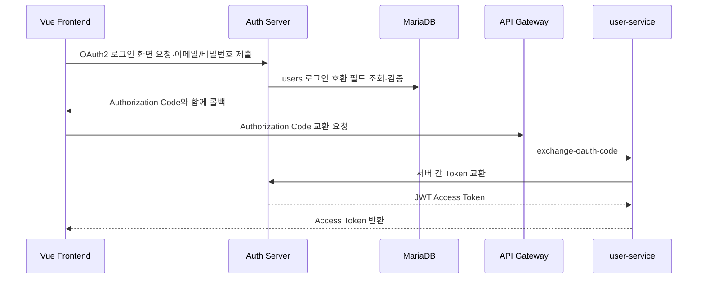
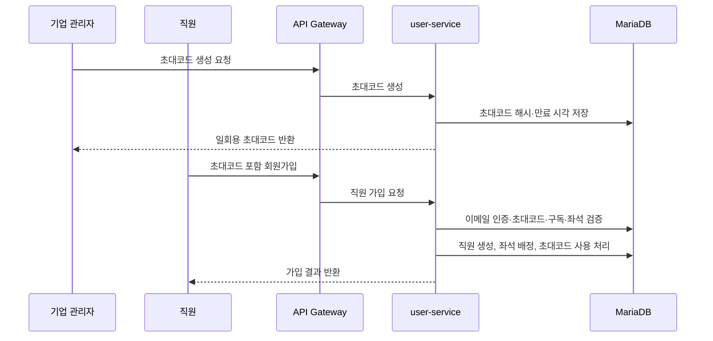
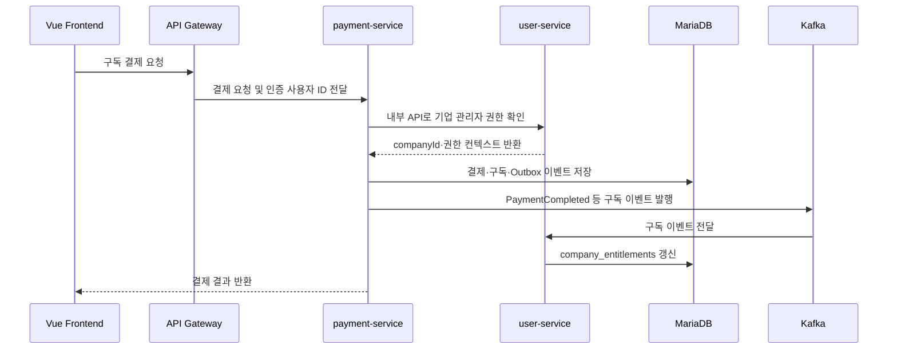
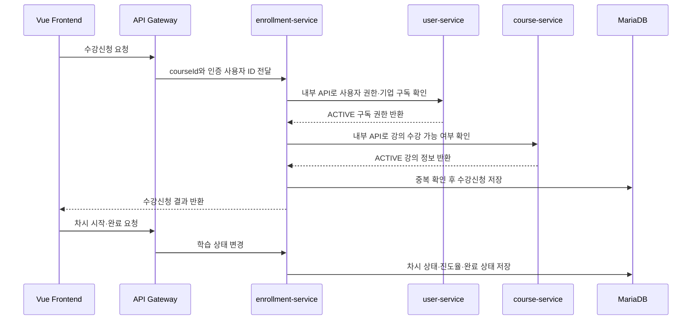
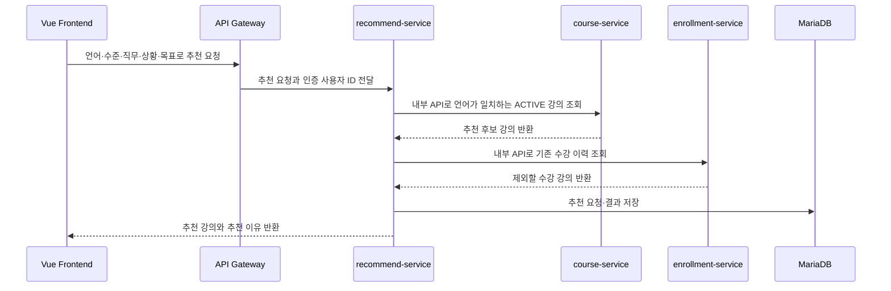

# LinguaRoute MSA

> 이 프로젝트는 교육 목적으로 작성된 실습 코드입니다. 상용 서비스에 적용하려면 배포 목적에 맞는 보완이 필요합니다. 문의: audit@korea.ac.kr, Sungryel Lim Ph.D

## 프로젝트 문서

- [에이전트 작업 지침](./AGENTS.md)
- [서비스 기획서](./docs/product-spec.md)
- [MVP 체크리스트](./docs/mvp-checklist.md)
- [팀원 1 user-service 구현 계획](./docs/team1-user-service-plan.md)
- [API 명세서](./docs/api-spec.md)
- [ERD](./docs/erd.md)

## 팀 Git 협업 규칙

처음 참여하는 팀원도 같은 방식으로 작업할 수 있도록 아래 규칙을 지켜 주세요.

### 브랜치 역할

브랜치 흐름은 다음과 같습니다.

```text
feature/기능명 → dev → main
```

- `main`: 최종 결과물만 관리하는 브랜치입니다. 직접 작업하거나 직접 푸시하지 않습니다.
- `dev`: 각 기능을 모아 함께 테스트하는 개발 통합 브랜치입니다. 기능 브랜치의 Pull Request는 `dev`로 병합합니다.
- `feature/기능명`: 개인 기능 작업 브랜치입니다. 항상 최신 `dev`에서 생성합니다.
- 최종 배포 또는 제출 시에만 `dev`에서 `main`으로 Pull Request를 생성합니다.

브랜치 이름의 기능명은 영문 소문자와 하이픈을 사용합니다.

```text
feature/user-login
feature/course-list
feature/payment-cancel
```

### 최초 `dev` 브랜치 생성

저장소 관리자가 한 번만 실행합니다.

```bash
git checkout main
git pull origin main
git checkout -b dev
git push -u origin dev
```

### 기능 개발 순서

#### 1. 최신 `dev` 받기

새 작업을 시작하기 전에 로컬 `dev`를 최신 상태로 맞춥니다.

```bash
git checkout dev
git pull origin dev
```

#### 2. 기능 브랜치 생성하기

```bash
git checkout -b feature/기능명
```

예시:

```bash
git checkout -b feature/user-login
```

#### 3. 변경 사항 커밋하기

```bash
git status
git add 변경한파일
git commit -m "feat: 로그인 기능 추가"
```

`git add .`을 바로 사용하지 말고, `git status`로 확인한 뒤 작업한 파일만 추가하는 것을 권장합니다.

#### 4. 작업 중 최신 `dev`와 동기화하기

기능 개발 중에도 수시로 최신 `dev`를 병합합니다. 특히 Pull Request를 만들기 전에는 반드시 동기화합니다.

```bash
git checkout feature/기능명
git fetch origin
git merge origin/dev
```

충돌이 발생하면 충돌 파일을 수정하고 테스트한 뒤 커밋합니다. 해결하기 어렵다면 혼자 강제로 처리하지 말고 팀원과 함께 확인합니다.

#### 5. 기능 브랜치 푸시하기

처음 푸시할 때:

```bash
git push -u origin feature/기능명
```

이후 같은 브랜치에서 다시 푸시할 때:

```bash
git push
```

#### 6. `dev`로 Pull Request 만들기

- Base 브랜치는 `dev`로 지정합니다.
- Compare 브랜치는 본인의 `feature/기능명`으로 지정합니다.
- 변경 내용과 테스트 결과를 설명합니다.
- 리뷰가 끝난 뒤 `dev`에 병합합니다.
- `main`과 `dev`에는 직접 푸시하지 않습니다.

### 커밋 메시지 규칙

[Conventional Commits](https://www.conventionalcommits.org/) 형식을 사용하며 제목과 본문은 한국어로 작성합니다.

```text
타입: 한국어 제목

한국어 본문(선택)
```

기본 규칙:

- 타입 뒤에 콜론과 공백을 입력합니다. 예: `feat: 로그인 기능 추가`
- 제목은 변경 내용을 알 수 있도록 짧고 명확한 한국어로 작성합니다.
- 제목 끝에는 마침표를 붙이지 않습니다.
- 하나의 커밋에는 하나의 목적만 담습니다.
- 본문은 선택 사항이며 변경 이유나 주의사항이 필요할 때 한국어로 작성합니다.

주요 타입:

- `feat`: 새로운 기능 추가
- `fix`: 버그 수정
- `refactor`: 기능 변경 없는 코드 구조 개선
- `docs`: README 등 문서 수정
- `test`: 테스트 추가 또는 수정
- `style`: 코드 동작과 무관한 서식 수정
- `chore`: 설정, 의존성 등 기타 작업
- `build`: 빌드 설정 또는 빌드 시스템 변경
- `ci`: CI 설정 변경

예시:

```text
feat: 강의 목록 조회 기능 추가
fix: 결제 취소 시 상태가 변경되지 않는 문제 수정
refactor: 수강 신청 검증 로직을 서비스로 분리
docs: 브랜치 및 커밋 컨벤션 추가
test: 사용자 회원가입 서비스 테스트 추가
chore: 불필요한 로그 파일 제외 설정 추가
```

본문이 필요한 경우:

```bash
git commit -m "fix: 중복 수강 신청 문제 수정" \
  -m "같은 사용자가 동일한 강의를 여러 번 신청하지 못하도록 검증 로직을 추가했습니다."
```

## 실행 방법

### 1. 사전 준비

다음 프로그램과 파일이 필요합니다.

- Docker Desktop
- 교수님이 배포한 Docker 이미지 분할 파일
  - `msa-lecture-images.part.aa`
  - `msa-lecture-images.part.ab`
  - `msa-lecture-images.part.ac`

분할 파일에는 Auth Server, API Gateway와 수업용 기본 서비스 이미지가 들어 있습니다. 용량이 커서 Git에는 포함하지 않으므로 팀에서 별도로 전달받아 프로젝트 최상위 폴더에 넣습니다.

LinguaRoute 개발에서는 Auth Server와 API Gateway 이미지만 공통 실행 기반으로 사용합니다. `user-service`, `course-service`, `enrollment-service`, `payment-service`, `recommend-service`, `eureka-server`는 현재 저장소의 코드를 Docker로 빌드해서 실행합니다.

```text
linguaroute-msa/
├── docker-compose.yml
├── msa-lecture-images.part.aa
├── msa-lecture-images.part.ab
├── msa-lecture-images.part.ac
├── course-service/
├── enrollment-service/
└── ...
```

Docker Desktop을 실행한 뒤 터미널에서 다음 명령으로 정상 동작을 확인합니다.

```bash
docker --version
docker compose version
docker info
```

`docker info`에서 Docker 서버 정보가 출력되면 실행 준비가 된 것입니다. `Cannot connect to the Docker daemon` 오류가 나오면 Docker Desktop이 완전히 실행될 때까지 기다린 뒤 다시 확인합니다.

### 2. 프로젝트 폴더로 이동

모든 Docker Compose 명령은 `docker-compose.yml`이 있는 프로젝트 최상위 폴더에서 실행합니다.

```bash
cd linguaroute-msa
```

현재 위치와 필수 파일을 확인합니다.

```bash
pwd
ls docker-compose.yml msa-lecture-images.part.aa msa-lecture-images.part.ab msa-lecture-images.part.ac
```

### 3. 공통 이미지 불러오기

분할 파일을 하나의 압축 이미지 파일로 합친 뒤 Docker에 불러옵니다. 처음 실행할 때 한 번만 하면 됩니다.

```bash
cat msa-lecture-images.part.aa msa-lecture-images.part.ab msa-lecture-images.part.ac > msa-lecture-images.tar.gz
docker load -i msa-lecture-images.tar.gz
```

다음 명령으로 이미지가 있는지 확인합니다.

```bash
docker images
```

이미지 목록에 최소 아래 태그가 있어야 합니다.

```text
msa-lecture/api-gateway:1.0
msa-lecture/auth-server:1.0
```

### 4. Docker Compose 설정 확인

실행 전에 Compose 파일에 문법 오류가 없는지 확인합니다.

```bash
docker compose config --quiet
docker compose config --services
```

서비스 목록이 출력되고 오류 메시지가 없으면 정상입니다.

### 5. 전체 서비스 실행

현재 저장소의 우리 서비스 코드를 빌드하면서 컨테이너를 실행합니다. 개발 중 코드 수정 사항을 Docker 실행에 반영하려면 이 명령을 사용합니다.

```bash
docker compose up -d --build
```

`-d`는 컨테이너를 백그라운드에서 실행한다는 의미이고, `--build`는 현재 로컬 소스 코드로 서비스 이미지를 다시 빌드한다는 의미입니다.

처음 실행할 때는 이미지 다운로드와 Gradle 빌드 때문에 시간이 걸릴 수 있습니다. 서비스는 다음 순서로 기동됩니다.

```text
MariaDB / Kafka
  → Eureka
    → Auth Server
      → API Gateway + 4개 서비스
        → Recommend Service
```

교수님 안내의 `docker compose up -d --no-build --pull never`는 배포받은 이미지 그대로 실행하는 방식입니다. 이 프로젝트에서는 팀이 수정한 최신 코드가 실행되어야 하므로, 기능 개발과 검증에는 기본적으로 `docker compose up -d --build`를 사용합니다.

다만 외부 다운로드 제한 때문에 빌드가 실패하면 테더링을 사용하거나, 필요한 의존성이 캐시된 팀원 환경에서 빌드합니다. Auth Server와 API Gateway 이미지를 못 받는 문제는 위의 `docker load` 절차로 해결합니다.

### 6. 실행 상태 확인

모든 컨테이너의 상태를 확인합니다.

```bash
docker compose ps
```

`STATUS`가 `Up` 또는 `healthy`이면 정상입니다. MariaDB, Kafka, Eureka, Auth Server의 상태 확인이 끝날 때까지 1~3분 정도 걸릴 수 있습니다.

주요 접속 주소와 포트는 다음과 같습니다.

```text
API Gateway        http://localhost:8080
Eureka Server      http://localhost:8761
Auth Server        http://localhost:9000
User Service       http://localhost:8081
Course Service     http://localhost:8082
Enrollment Service http://localhost:8083
Payment Service    http://localhost:8084
Recommend Service  http://localhost:8085
MailHog UI         http://localhost:8025
MariaDB            localhost:3379
Kafka              localhost:9092
```

### 기능별 요청 흐름

기능을 처리할 때 어떤 서버가 어떤 순서로 통신하는지 보여 주는 요약입니다. 외부 요청은 `Vue Frontend → API Gateway → 대상 서비스` 순서이고, 서비스 간 내부 호출은 Gateway를 거치지 않는 `/internal/**` API입니다. URL·요청·응답은 [API 명세서](./docs/api-spec.md), 데이터 소유권과 이벤트 payload는 [ERD](./docs/erd.md)를 기준으로 합니다.

#### 1. 이메일 인증과 기업 대표 회원가입



#### 2. 로그인과 Access Token 발급



#### 3. 직원 초대와 직원 회원가입



#### 4. 구독 결제와 기업 이용 권한 갱신



#### 5. 수강신청과 학습 진도 처리



#### 6. AI 강의 추천



### 이메일 인증 로컬 확인

이메일 인증 요청은 Gateway 공개 가입 경로를 사용합니다. 제공 Gateway 이미지가 신규 공개 `/api/auth/**` 경로를 허용하지 않으므로, 기업 가입 경로에 `action` 쿼리 파라미터를 사용합니다.

```bash
curl -X POST 'http://localhost:8080/api/users/register?action=request-email-verification' \
  -H 'Content-Type: application/json' \
  -d '{"email":"admin@example.com","purpose":"SIGNUP"}'
```

MailHog UI `http://localhost:8025`에서 수신된 6자리 코드를 확인한 뒤 다음 요청을 보냅니다.

```bash
curl -X POST 'http://localhost:8080/api/users/register?action=confirm-email-verification' \
  -H 'Content-Type: application/json' \
  -d '{"email":"admin@example.com","verificationCode":"123456"}'
```

응답의 `emailVerificationToken`은 일반 `POST /api/users/register` 기업 가입 요청에 한 번만 사용할 수 있습니다.

Eureka 화면(<http://localhost:8761/>)에서 각 서비스가 등록되었는지도 확인합니다.

Gateway와 대표 API가 실제로 연결되는지 확인하려면 다음 명령을 사용합니다.

```bash
curl -sS -u service-client:service-secret \
  -X POST http://localhost:8080/oauth2/token \
  -H 'Content-Type: application/x-www-form-urlencoded' \
  -d 'grant_type=client_credentials&scope=service.read service.write'
```

응답의 `access_token` 값을 사용해 보호 API를 호출합니다.

```bash
TOKEN=응답의_access_token값
curl -H "Authorization: Bearer $TOKEN" http://localhost:8080/api/courses
curl -H "Authorization: Bearer $TOKEN" http://localhost:8080/api/plans
```

두 요청이 `200 OK`를 반환하면 Gateway, Auth Server, Course Service, Payment Service가 함께 동작하는 상태입니다.

### 브라우저 OAuth2 로그인

LinguaRoute는 소셜 로그인이 아니라 자체 이메일·비밀번호 계정으로 Auth Server에 로그인합니다. 브라우저는 `http://localhost:3000`에서 시작한 뒤 Auth Server의 OAuth2 Authorization Code 흐름으로 JWT를 받습니다.

- 프로젝트 루트에서 `cp .env.example .env`를 실행하고 `AUTH_WEB_CLIENT_SECRET`은 제공 Auth Server의 등록값으로 로컬에만 설정합니다.
- Vite 개발 서버는 등록된 콜백 URI와 맞게 `3000` 포트로 실행됩니다.
- `user-service`에는 `AUTH_WEB_CLIENT_SECRET` 환경변수가 필요합니다. 값은 제공 Auth Server에 등록된 브라우저 클라이언트 비밀값이며 저장소에 추가하지 않습니다.
- 콜백은 `POST /api/users/register?action=exchange-oauth-code`로 코드를 전달합니다. user-service가 서버 간 통신으로 토큰을 교환하므로 프론트에 비밀값이 노출되지 않습니다.
- 로그아웃은 `POST /logout`으로 Auth Server 세션을 종료하고, 프론트는 sessionStorage의 Access Token을 삭제합니다.

### 7. 데모 데이터

`init-db/01_init.sql`에는 발표와 로컬 검증에 사용할 수 있는 최소 seed 데이터가 포함되어 있습니다. MariaDB 볼륨을 처음 만드는 환경에서는 컨테이너 기동 시 자동 적용됩니다.

공통 비밀번호는 `Password123!`입니다.

| 구분 | 이메일 | 설명 |
| --- | --- | --- |
| 플랫폼 관리자 | `platform-admin@linguaroute.local` | 플랫폼 운영자 계정 |
| 기업 관리자 | `admin@scala-tech.local` | 스칼라테크 관리자, 활성 구독 보유 |
| 직원 | `employee.lee@scala-tech.local` | 스칼라테크 직원, 영어 강의 학습·수료 데이터 보유 |
| 직원 | `employee.kim@scala-tech.local` | 스칼라테크 직원, 일본어 강의 신청 데이터 보유 |
| 기업 관리자 | `admin@global-link.local` | 글로벌링크 관리자 |

대표 seed 데이터는 다음과 같습니다.

- 기업: `스칼라테크`, `글로벌링크`
- 요금제: `BUSINESS_50`, `STARTUP_20`
- 활성 구독: 스칼라테크 월간 `BUSINESS_50`
- 강의: 영어·일본어·중국어 과정 6개, 이 중 5개 활성
- 수강: 스칼라테크 직원의 학습 중·수료·신청 상태 데이터

기존 MariaDB 볼륨이 이미 있는 환경에서 seed만 다시 적용하려면 다음 명령을 사용합니다.

```bash
docker exec lecturedb mariadb -umanager -pSqlDba-1 lecture_db -e "source /docker-entrypoint-initdb.d/01_init.sql"
```

### 8. 로그 확인

전체 서비스의 최근 로그를 확인합니다.

```bash
docker compose logs --tail=100
```

새 로그를 계속 확인하려면 다음 명령을 사용합니다. 종료할 때는 `Ctrl+C`를 누릅니다.

```bash
docker compose logs -f
```

특정 서비스의 로그만 확인할 수도 있습니다.

```bash
docker compose logs -f --tail=100 서비스명
```

사용할 수 있는 서비스명은 다음과 같습니다.

```text
mariadb
kafka
eureka-server
auth-server
api-gateway
user-service
course-service
enrollment-service
payment-service
recommend-service
```

예를 들어 Course Service 로그만 보려면 다음과 같이 실행합니다.

```bash
docker compose logs -f --tail=100 course-service
```

### 9. 변경된 서비스만 다시 빌드

특정 서비스의 코드를 수정한 경우 전체를 다시 빌드하지 않고 해당 서비스만 재빌드할 수 있습니다.

```bash
docker compose up -d --build 서비스명
```

예시:

```bash
docker compose up -d --build course-service
```

변경 내용이 반영되지 않을 때만 캐시 없이 다시 빌드합니다.

```bash
docker compose build --no-cache course-service
docker compose up -d course-service
```

소스 코드 변경 후 `docker compose up -d`만 실행하면 이미 만들어진 이미지가 그대로 재사용될 수 있습니다. 코드 변경을 Docker 컨테이너에 반영하려면 `--build`를 붙입니다.

### 10. 전체 서비스 종료

컨테이너와 네트워크를 종료합니다. MariaDB와 Kafka 데이터 볼륨은 유지됩니다.

```bash
docker compose down
```

컨테이너를 다시 실행할 때는 다음 명령을 사용합니다.

```bash
docker compose up -d
```

데이터까지 완전히 초기화해야 할 때만 다음 명령을 사용합니다.

```bash
docker compose down -v
```

`docker compose down -v`는 MariaDB와 Kafka의 저장 데이터를 삭제하므로 팀원과 확인한 뒤 사용합니다.

### 11. 자주 발생하는 오류

#### Docker 서버에 연결할 수 없는 경우

```text
Cannot connect to the Docker daemon
```

Docker Desktop을 실행하고 `docker info`가 정상 출력되는지 확인합니다.

#### Auth Server 또는 API Gateway 이미지를 찾지 못하는 경우

```text
pull access denied
No such image
```

`msa-lecture-images.part.*` 파일이 프로젝트 최상위 폴더에 있는지 확인한 뒤 이미지를 다시 불러옵니다.

```bash
cat msa-lecture-images.part.aa msa-lecture-images.part.ab msa-lecture-images.part.ac > msa-lecture-images.tar.gz
docker load -i msa-lecture-images.tar.gz
docker images
```

#### 특정 서비스가 실행되지 않는 경우

먼저 상태와 해당 서비스 로그를 확인합니다.

```bash
docker compose ps
docker compose logs --tail=200 서비스명
```

#### 결제 생성 시 예전 컬럼 오류가 나는 경우

이미 실행한 적 있는 MariaDB 볼륨에는 과거 테이블 구조가 남아 있을 수 있습니다. 예를 들어 `POST /api/subscriptions` 호출 중 `payments` 테이블의 `user_id`, `course_id`, `transaction_id`, `updated_at` 같은 현재 ERD에 없는 컬럼 때문에 오류가 나거나, 데모 seed 적용 중 `courses` 테이블의 `category`, `price`, `instructor_id`, `enrollment_count` 같은 예전 컬럼 때문에 오류가 나면 코드 문제가 아니라 로컬 DB 볼륨의 오래된 스키마 문제일 가능성이 큽니다.

현재 코드와 `init-db/01_init.sql` 기준의 `payments` 테이블은 기업 구독 결제용 `company_id`, `subscription_id`, `plan_price_id`, `idempotency_key` 구조를 사용하고, `courses`와 `enrollments`는 LinguaRoute 강의·수강 도메인 컬럼만 사용합니다. 하지만 Docker의 기존 볼륨에는 `init-db`가 다시 적용되지 않습니다.

상태 확인:

```bash
docker exec -it lecturedb mariadb -umanager -pSqlDba-1 lecture_db
DESC payments;
```

팀 공용 데이터가 필요 없고 초기화해도 되는 개발 환경에서만 팀원과 확인한 뒤 `docker compose down -v`로 볼륨을 삭제하고 다시 실행합니다. 데이터를 유지해야 하면 별도 마이그레이션 SQL을 작성해서 오래된 컬럼을 정리합니다.

#### Gateway 공개 가입 경로

제공받은 API Gateway 이미지는 `/api/users/register`와 OAuth2 경로를 공개 라우팅합니다. 수업 가이드의 JSON `POST /api/users/login` 예시는 현재 제공 이미지와 다르며 `401 Unauthorized`를 반환합니다. 브라우저 로그인은 `/oauth2/authorize`와 `/login`을 사용합니다. LinguaRoute 목표 API인 `POST /api/companies` 기업 관리자 가입은 user-service에 구현되어 있지만, 제공 Gateway 이미지의 보안 허용 목록에 없으면 Gateway 경유 호출이 `401 Unauthorized`를 반환합니다.

Gateway 이미지는 수정하지 않는 전제이므로, 외부 기업 관리자 가입은 Gateway가 공개 허용하는 `POST /api/users/register`를 사용합니다. 요청과 응답 구조는 기존 `POST /api/companies` 기업 가입 API와 같습니다. `POST /api/companies`는 user-service 직접 호출에서는 유지되지만 Gateway 경유 MVP 기준 경로가 아닙니다.

### 프론트엔드 실행

현재 `vue-frontend`는 `docker-compose.yml`에 포함되어 있지 않으므로 백엔드 실행 후 별도 터미널에서 로컬로 실행합니다.

```bash
cd vue-frontend
npm install
npm run dev
```

브라우저 접속 주소: <http://localhost:3000/>
