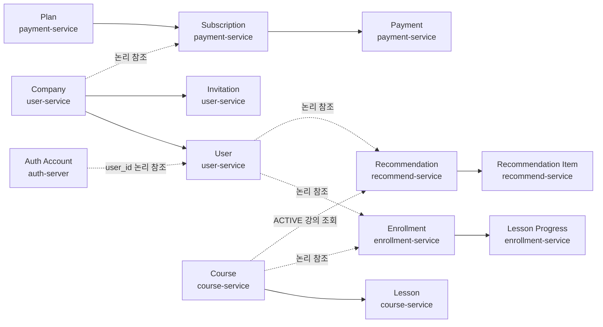
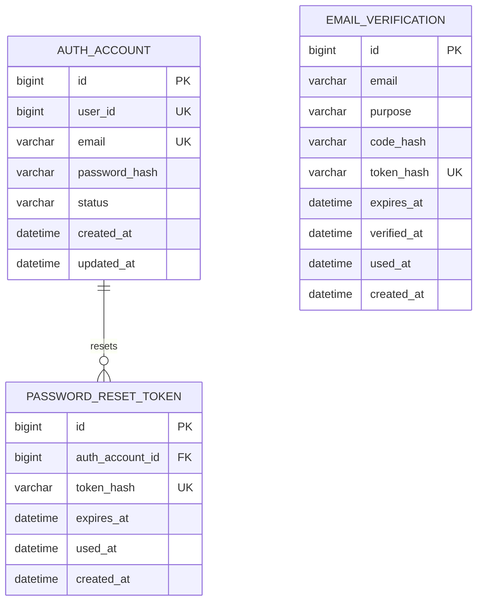
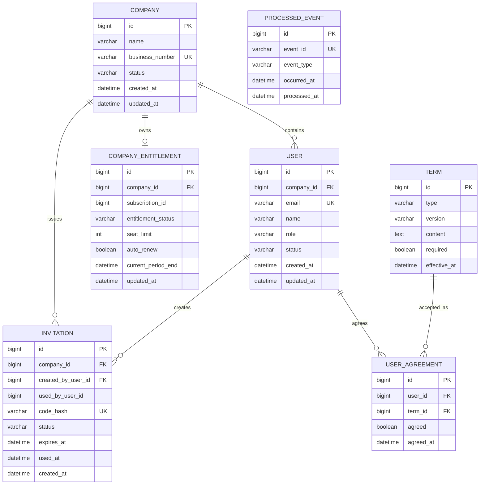
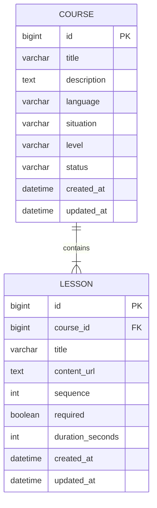
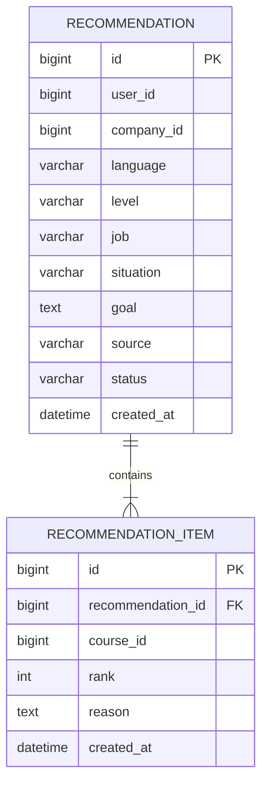
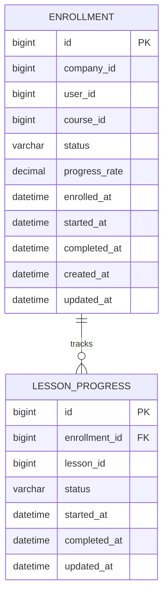
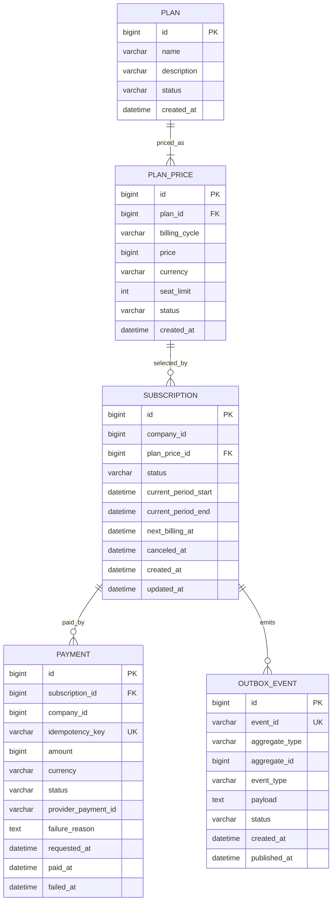

# LinguaRoute MSA ERD

> 문서 상태: MVP 논리 설계 초안

## 1. 설계 원칙

- MVP에서는 현재 Docker Compose 구성과 동일하게 MariaDB 한 개와 `lecture_db` 한 개를 사용합니다.
- 각 마이크로서비스는 공용 `lecture_db` 안에서 자신의 테이블만 소유하고 접근합니다.
- 다른 서비스 소유 테이블을 직접 조회·조인하거나 서비스 사이 외래키를 만들지 않습니다.
- 다른 서비스에서 받은 `company_id`, `user_id`, `course_id` 등은 논리 참조 ID로만 저장합니다.
- 서비스 간 데이터 확인은 REST API 또는 Kafka 이벤트로 처리합니다.
- 기업별 데이터는 `company_id`를 기준으로 분리합니다.

---

## 2. 전체 논리 관계



점선은 서로 다른 서비스 소유 영역 사이의 논리 참조이며 실제 데이터베이스 외래키를 생성하지 않습니다.

---

## 3. auth-server ERD



### auth-server 주요 제약조건

| 테이블 | 제약조건 |
| --- | --- |
| `auth_account` | 로그인 이메일 유일, 비밀번호는 해시만 저장 |
| `auth_account.user_id` | `user-service` 사용자에 대한 논리 참조이며 실제 외래키를 만들지 않음 |
| `email_verification` | 인증 코드와 토큰은 해시로 저장하고 만료·일회성 사용 처리 |
| `password_reset_token` | 토큰은 해시로 저장하고 만료·일회성 사용 처리 |

Auth Server는 로그인, 이메일 인증, 아이디 찾기, 비밀번호 변경·재설정과 Access Token 발급을 소유합니다. Refresh Token은 저장하거나 발급하지 않습니다. 회원가입 중에는 인증 계정을 `PENDING`으로 생성하고 `user-service` 프로필의 `user_id`를 연결한 뒤 `ACTIVE`로 전환합니다. 로그인 시 `user_id`로 `user-service`의 최신 상태·역할·기업 소속을 조회하여 Access Token의 `userId`, `companyId`, `role` 클레임에 반영합니다. 아이디 찾기는 이름과 기업 사업자번호로 대상을 확인한 후 등록된 로그인 이메일로만 안내합니다.

---

## 4. user-service ERD



### user-service 주요 제약조건

| 테이블 | 제약조건 |
| --- | --- |
| `company` | `business_number` 유일 |
| `user` | `email` 유일 |
| `user.email` | Auth Server 로그인 이메일의 조회용 사본이며 MVP에서는 직접 변경하지 않음 |
| `invitation` | 원문 코드 대신 `code_hash` 저장 및 유일 처리 |
| `invitation` | `UNUSED` 상태이고 만료 전일 때만 사용 가능 |
| `company_entitlement` | 기업별 1개, 결제 이벤트의 최신 구독 권한을 조회용으로 저장 |
| `processed_event` | `event_id` 유일로 Kafka 이벤트 중복 처리 방지 |
| `user_agreement` | `(user_id, term_id)` 유일 |

`user-service`는 비밀번호와 인증 토큰을 저장하지 않습니다. 활성 직원 수가 사용 좌석 수입니다. 구매 좌석 수와 구독 상태의 원본은 `payment-service`가 소유하며, `user-service`는 Kafka 이벤트로 받은 최신 이용 권한을 `company_entitlement`에 저장하여 직원 가입 시 사용합니다. `subscription_id`는 `payment-service`에 대한 논리 참조입니다. 구독 해지 시 `auto_renew`만 `false`로 바꾸고 `current_period_end`까지 `entitlement_status=ACTIVE`를 유지합니다.

---

## 5. course-service ERD



### course-service 주요 제약조건

| 테이블 | 제약조건 |
| --- | --- |
| `course` | 상태는 `ACTIVE`, `INACTIVE`만 사용 |
| `lesson` | `(course_id, sequence)` 유일 |

강의 등록·수정·활성·비활성 상태 관리는 확정 MVP입니다. 별도의 게시·비게시 상태는 두지 않고 `ACTIVE`, `INACTIVE`로 통합합니다.

---

## 6. recommend-service ERD



### recommend-service 주요 제약조건

| 테이블 | 제약조건 |
| --- | --- |
| `recommendation_item` | `(recommendation_id, course_id)` 유일 |
| 추천 결과 | `ACTIVE` 강의와 요청 언어가 일치하는 강의만 저장 |

`recommendation.user_id`와 `company_id`는 `user-service`, `recommendation_item.course_id`는 `course-service`에 대한 논리 참조입니다. `recommend-service`는 다른 서비스의 테이블을 직접 조회하지 않고 `course-service` API로 추천 후보와 상태를 검증합니다.

---

## 7. enrollment-service ERD



### enrollment-service 주요 제약조건

| 테이블 | 제약조건 |
| --- | --- |
| `enrollment` | `(user_id, course_id)` 유일하여 중복 수강신청 방지 |
| `lesson_progress` | `(enrollment_id, lesson_id)` 유일 |
| 진도율 | 클라이언트 입력 금지, 서버 계산 |
| 완료 상태 | 모든 필수 차시 완료 시 `COMPLETED` |

`company_id`와 `user_id`는 `user-service`, `course_id`와 `lesson_id`는 `course-service`에 대한 논리 참조입니다.

### 진도율 계산

```text
진도율 = 완료한 필수 차시 수 / 전체 필수 차시 수 × 100
```

---

## 8. payment-service ERD



### payment-service 주요 제약조건

| 테이블 | 제약조건 |
| --- | --- |
| `plan_price` | `(plan_id, billing_cycle)` 유일 |
| `subscription` | 기업별 활성 구독은 최대 1개 |
| `payment` | `idempotency_key` 유일로 중복 결제 방지 |
| `payment` | 금액은 요청값이 아니라 `plan_price`에서 서버가 결정 |
| `outbox_event` | 결제·구독 상태 변경과 같은 트랜잭션으로 저장하고 `event_id` 유일 처리 |

`subscription.company_id`와 `payment.company_id`는 `user-service`에 대한 논리 참조입니다.

---

## 9. 추후 확장: 감사 로그

주요 작업 감사 로그는 확정 MVP가 아니라 추후 확장 기능입니다. 확장 시에도 통합 운영 DB를 만들지 않고 각 서비스가 자신의 감사 로그를 소유합니다.

| 소유 서비스 | 추후 테이블 | 기록 대상 예시 |
| --- | --- | --- |
| `user-service` | `user_audit_log` | 초대코드, 직원 상태, 약관 동의 변경 |
| `course-service` | `course_admin_audit_log` | 강의 등록·수정·상태 변경 |
| `enrollment-service` | `enrollment_audit_log` | 수강신청·학습 상태 변경 |
| `payment-service` | `payment_audit_log` | 구독·결제 상태 변경 |

감사 로그를 구현할 때는 append-only 방식으로 저장하고, 플랫폼 관리자 조회 API는 Gateway가 각 서비스의 관리자 API를 조합합니다.

---

## 10. 상태값

### 10.1 인증·사용자·초대

| 엔티티 | 상태 |
| --- | --- |
| `AuthAccount` | `PENDING`, `ACTIVE`, `INACTIVE`, `WITHDRAWN` |
| `Company` | `ACTIVE`, `INACTIVE` |
| `User` | `ACTIVE`, `INACTIVE`, `WITHDRAWN` |
| `Invitation` | `UNUSED`, `USED`, `EXPIRED`, `REVOKED` |

### 10.2 강의·수강

| 엔티티 | 상태 |
| --- | --- |
| `Course` | `ACTIVE`, `INACTIVE` |
| `Enrollment` | `ENROLLED`, `LEARNING`, `COMPLETED` |
| `LessonProgress` | `NOT_STARTED`, `LEARNING`, `COMPLETED` |

### 10.3 구독·결제

| 엔티티 | 상태 |
| --- | --- |
| `Subscription` | `PENDING`, `ACTIVE`, `CANCELED`, `EXPIRED` |
| `Payment` | `PENDING`, `SUCCESS`, `FAILED` |

### 10.4 AI 추천

| 엔티티 | 상태 |
| --- | --- |
| `Recommendation` | `SUCCESS`, `FALLBACK`, `FAILED` |
| 추천 출처 | `AI`, `RULE_BASED_FALLBACK` |

---

## 11. Kafka 이벤트

이벤트 발행자는 `payment-service`, 이용 권한 소비자는 `user-service`입니다. 모든 이벤트는 `eventId`를 가지며 소비자는 `processed_event.event_id`로 중복 처리를 방지합니다.

### 11.1 PaymentCompleted

```json
{
  "eventId": "c149229f-c428-4bf9-bb1a-b97431c4f8b5",
  "eventType": "PaymentCompleted",
  "occurredAt": "2026-08-10T10:30:00+09:00",
  "companyId": 10,
  "subscriptionId": 7001,
  "paymentId": 8001,
  "planPriceId": 1,
  "seatLimit": 50,
  "currentPeriodEnd": "2026-09-10T10:30:00+09:00"
}
```

`user-service`는 `entitlement_status=ACTIVE`, 좌석 한도와 현재 이용 종료일을 반영합니다.

### 11.2 PaymentFailed

```json
{
  "eventId": "70fb3a43-d0f6-4af2-b8e2-133299bdfbbb",
  "eventType": "PaymentFailed",
  "occurredAt": "2026-08-10T10:31:00+09:00",
  "companyId": 10,
  "subscriptionId": 7001,
  "paymentId": 8002,
  "planPriceId": 1,
  "failureCode": "CARD_DECLINED",
  "failureReason": "결제가 승인되지 않았습니다."
}
```

초기 결제 실패 시 이용 권한을 활성화하지 않습니다. 갱신 결제 실패 시 현재 이용 종료일 전까지 기존 권한을 유지하며, 별도의 만료 처리 시점에 `SubscriptionExpired`를 발행합니다.

### 11.3 SubscriptionCanceled

```json
{
  "eventId": "7d0c5a16-361b-40ce-b41a-257e29e61f80",
  "eventType": "SubscriptionCanceled",
  "occurredAt": "2026-08-15T09:00:00+09:00",
  "companyId": 10,
  "subscriptionId": 7001,
  "canceledAt": "2026-08-15T09:00:00+09:00",
  "effectiveAt": "2026-09-10T10:30:00+09:00"
}
```

`user-service`는 `auto_renew=false`로 변경하지만 `effectiveAt`까지 `entitlement_status=ACTIVE`를 유지합니다.

### 11.4 SubscriptionExpired

```json
{
  "eventId": "43d96592-3b2c-4ec8-97d3-12c34825eb04",
  "eventType": "SubscriptionExpired",
  "occurredAt": "2026-09-10T10:30:00+09:00",
  "companyId": 10,
  "subscriptionId": 7001,
  "expiredAt": "2026-09-10T10:30:00+09:00"
}
```

`user-service`는 `entitlement_status=EXPIRED`로 변경하고 신규 직원 가입과 신규 수강신청을 차단합니다.

### 11.5 SubscriptionRenewed

```json
{
  "eventId": "a59e5e28-3dcf-4738-82a1-7de8447a9565",
  "eventType": "SubscriptionRenewed",
  "occurredAt": "2026-09-10T10:30:00+09:00",
  "companyId": 10,
  "subscriptionId": 7001,
  "paymentId": 8101,
  "planPriceId": 1,
  "seatLimit": 50,
  "currentPeriodStart": "2026-09-10T10:30:00+09:00",
  "currentPeriodEnd": "2026-10-10T10:30:00+09:00",
  "nextBillingAt": "2026-10-10T10:30:00+09:00"
}
```

`user-service`는 `entitlement_status=ACTIVE`, `auto_renew=true`, 좌석 한도와 새 이용 기간을 반영합니다.

### 11.6 처리 흐름

```text
payment-service가 상태 변경과 같은 트랜잭션에서 Outbox 이벤트 저장
→ Kafka로 이벤트 발행
→ user-service가 eventId 중복 여부 확인
→ company_entitlement 반영
→ processed_event 저장
```

상태 변경과 이벤트 발행 사이의 유실을 방지하기 위해 Transactional Outbox 방식을 사용합니다.

MVP에서는 미발행 Outbox 이벤트를 5초 간격으로 재시도하고 성공할 때까지 삭제하지 않습니다. `processed_event`는 프로젝트 기간 동안 삭제하지 않아 동일한 `eventId`의 재수신을 계속 차단합니다.

---

## 12. 삭제 정책

| 데이터 | 정책 |
| --- | --- |
| 인증 계정 | 물리 삭제 대신 Auth Server에서 `INACTIVE` 또는 `WITHDRAWN` 상태 사용 |
| 기업·사용자 | 물리 삭제 대신 `INACTIVE` 또는 `WITHDRAWN` 상태 사용 |
| 강의 | 수강 이력 보존을 위해 물리 삭제 대신 `INACTIVE` 사용 |
| 초대코드 | 폐기 시 `REVOKED`, 만료 시 `EXPIRED` 사용 |
| 수강 이력 | 학습 기록 보존을 위해 물리 삭제하지 않음 |
| 결제 | 회계 및 감사 목적으로 삭제하지 않음 |
| 감사 로그 | 추후 구현 시 수정·삭제하지 않는 append-only 방식 사용 |

---

## 13. 데이터 구현 체크리스트

| 확인 항목 | 이유 |
| --- | --- |
| 제공 백엔드 엔티티와 테이블 | 현재 ERD와 실제 구조의 차이 확인 |
| 데이터베이스 | MariaDB 한 개와 `lecture_db`를 유지하고 서비스별 소유 테이블만 변경 |
| 서비스 경계 | 다른 서비스 소유 테이블 직접 조회·조인과 서비스 사이 외래키가 없는지 확인 |
| 논리 참조 | 서비스 밖의 ID가 논리 참조로만 저장되는지 확인 |
| 이벤트 전달 보장 | Outbox를 5초 간격으로 재시도하고 `processed_event`는 프로젝트 기간 동안 보관 |
