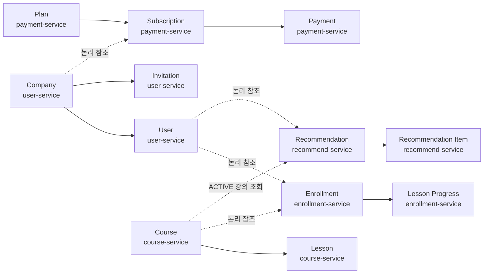
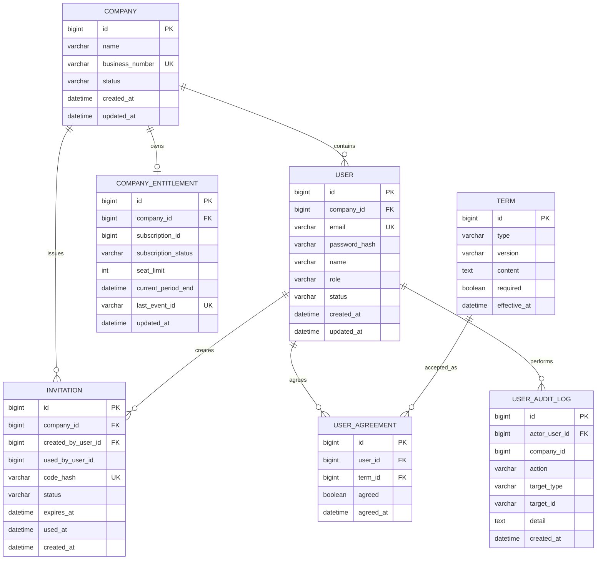
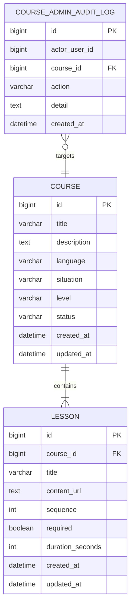
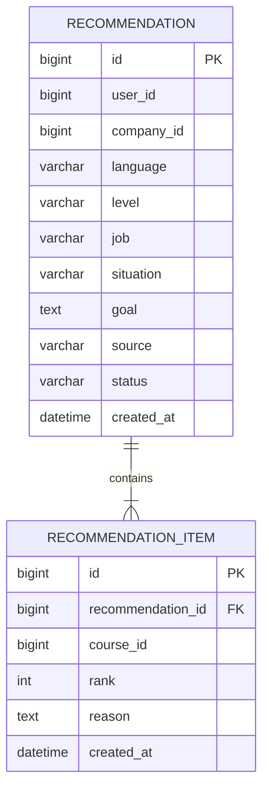
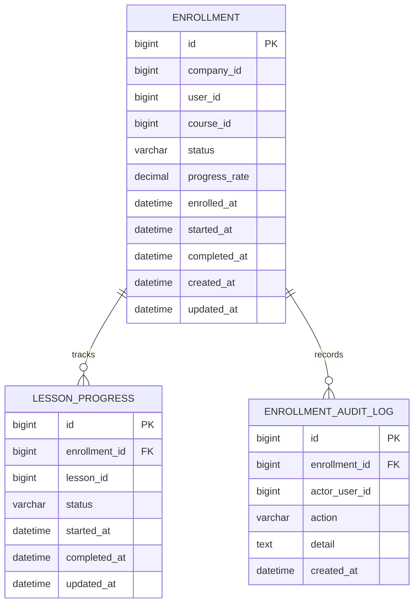
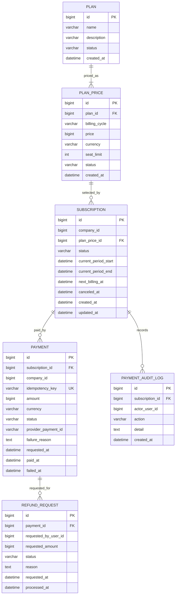

# LinguaRoute MSA ERD

> 문서 상태: MVP 논리 설계 초안

## 1. 설계 원칙

- 각 마이크로서비스는 자신의 데이터베이스를 소유합니다.
- 다른 서비스의 테이블을 직접 조인하지 않습니다.
- 다른 서비스에서 받은 `company_id`, `user_id`, `course_id` 등은 논리 참조 ID로만 저장합니다.
- 서비스 간 데이터 확인은 REST API 또는 Kafka 이벤트로 처리합니다.
- 기업별 데이터는 `company_id`를 기준으로 분리합니다.

---

## 2. 전체 논리 관계



점선은 서로 다른 서비스 DB 사이의 논리 참조이며 실제 데이터베이스 외래키를 생성하지 않습니다.

---

## 3. user-service ERD



### user-service 주요 제약조건

| 테이블 | 제약조건 |
| --- | --- |
| `company` | `business_number` 유일 |
| `user` | `email` 유일 |
| `invitation` | 원문 코드 대신 `code_hash` 저장 및 유일 처리 |
| `invitation` | `UNUSED` 상태이고 만료 전일 때만 사용 가능 |
| `company_entitlement` | 기업별 1개, 결제 이벤트의 최신 구독 권한을 조회용으로 저장 |
| `user_agreement` | `(user_id, term_id)` 유일 |

활성 직원 수가 사용 좌석 수입니다. 구매 좌석 수와 구독 상태의 원본은 `payment-service`가 소유하며, `user-service`는 Kafka 이벤트로 받은 최신 값을 `company_entitlement`에 저장하여 직원 가입 시 사용합니다. `subscription_id`는 `payment-service`에 대한 논리 참조입니다.

---

## 4. course-service ERD



### course-service 주요 제약조건

| 테이블 | 제약조건 |
| --- | --- |
| `course` | 상태는 `ACTIVE`, `INACTIVE`만 사용 |
| `lesson` | `(course_id, sequence)` 유일 |

강의 등록·수정·활성·비활성 상태 관리는 확정 MVP입니다. 별도의 게시·비게시 상태는 두지 않고 `ACTIVE`, `INACTIVE`로 통합합니다.

---

## 5. recommend-service ERD



### recommend-service 주요 제약조건

| 테이블 | 제약조건 |
| --- | --- |
| `recommendation_item` | `(recommendation_id, course_id)` 유일 |
| 추천 결과 | `ACTIVE` 강의와 요청 언어가 일치하는 강의만 저장 |

`recommendation.user_id`와 `company_id`는 `user-service`, `recommendation_item.course_id`는 `course-service`에 대한 논리 참조입니다. `recommend-service`는 다른 서비스의 테이블을 직접 조회하지 않고 `course-service` API로 추천 후보와 상태를 검증합니다.

---

## 6. enrollment-service ERD



### enrollment-service 주요 제약조건

| 테이블 | 제약조건 |
| --- | --- |
| `enrollment` | `(user_id, course_id)` 유일하여 중복 수강신청 방지 |
| `lesson_progress` | `(enrollment_id, lesson_id)` 유일 |
| 진도율 | 클라이언트 입력 금지, 서버 계산 |
| 완료 상태 | 모든 필수 차시 완료 시 `COMPLETED` |

`company_id`와 `user_id`는 `user-service`, `course_id`와 `lesson_id`는 `course-service`에 대한 논리 참조입니다.

### 진도율 계산

```text
진도율 = 완료한 필수 차시 수 / 전체 필수 차시 수 × 100
```

---

## 7. payment-service ERD



### payment-service 주요 제약조건

| 테이블 | 제약조건 |
| --- | --- |
| `plan_price` | `(plan_id, billing_cycle)` 유일 |
| `subscription` | 기업별 활성 구독은 최대 1개 |
| `payment` | `idempotency_key` 유일로 중복 결제 방지 |
| `payment` | 금액은 요청값이 아니라 `plan_price`에서 서버가 결정 |
| `refund_request` | 선택 기능이므로 테이블 구현을 미룰 수 있음 |

`subscription.company_id`, `payment.company_id`와 `requested_by_user_id`는 `user-service`에 대한 논리 참조입니다.

---

## 8. 상태값

### 8.1 사용자·초대

| 엔티티 | 상태 |
| --- | --- |
| `Company` | `ACTIVE`, `INACTIVE` |
| `User` | `ACTIVE`, `INACTIVE`, `WITHDRAWN` |
| `Invitation` | `UNUSED`, `USED`, `EXPIRED`, `REVOKED` |

### 8.2 강의·수강

| 엔티티 | 상태 |
| --- | --- |
| `Course` | `ACTIVE`, `INACTIVE` |
| `Enrollment` | `ENROLLED`, `LEARNING`, `COMPLETED` |
| `LessonProgress` | `NOT_STARTED`, `LEARNING`, `COMPLETED` |

### 8.3 구독·결제

| 엔티티 | 상태 |
| --- | --- |
| `Subscription` | `PENDING`, `ACTIVE`, `CANCELED`, `EXPIRED` |
| `Payment` | `PENDING`, `SUCCESS`, `FAILED` |
| `RefundRequest` | `REQUESTED`, `APPROVED`, `REJECTED`, `COMPLETED` |

### 8.4 AI 추천

| 엔티티 | 상태 |
| --- | --- |
| `Recommendation` | `SUCCESS`, `FALLBACK`, `FAILED` |
| 추천 출처 | `AI`, `RULE_BASED_FALLBACK` |

---

## 9. Kafka 이벤트

### PaymentCompleted

```json
{
  "eventId": "c149229f-c428-4bf9-bb1a-b97431c4f8b5",
  "eventType": "PaymentCompleted",
  "occurredAt": "2026-08-10T10:30:00+09:00",
  "companyId": 10,
  "subscriptionId": 7001,
  "paymentId": 8001,
  "planPriceId": 1,
  "seatLimit": 50,
  "currentPeriodEnd": "2026-09-10T10:30:00+09:00"
}
```

처리 결과:

```text
payment-service에서 결제 성공
→ PaymentCompleted 발행
→ user-service가 기업 구독 권한과 좌석 한도 반영
→ 직원 초대와 수강 권한 활성화
```

이벤트 중복 수신을 고려하여 소비 서비스는 `eventId`를 기준으로 이미 처리한 이벤트인지 확인해야 합니다.

---

## 10. 삭제 정책

| 데이터 | 정책 |
| --- | --- |
| 기업·사용자 | 물리 삭제 대신 `INACTIVE` 또는 `WITHDRAWN` 상태 사용 |
| 강의 | 수강 이력 보존을 위해 물리 삭제 대신 `INACTIVE` 사용 |
| 초대코드 | 폐기 시 `REVOKED`, 만료 시 `EXPIRED` 사용 |
| 수강 이력 | 학습 기록 보존을 위해 물리 삭제하지 않음 |
| 결제 | 회계 및 감사 목적으로 삭제하지 않음 |
| 감사 로그 | 수정·삭제하지 않는 append-only 방식 권장 |

---

## 11. 구현 전 확인사항

| 확인 항목 | 이유 |
| --- | --- |
| 제공 백엔드 엔티티와 테이블 | 현재 ERD와 실제 구조의 차이 확인 |
| Swagger의 실제 엔드포인트 | API 명세 URL 확정 |
| 결제 후 변경 대상 | 제공 구조가 `enrollment` 변경인지 기업 구독 변경인지 확인 |
| 정기결제 범위 | 실제 자동결제인지 모의 결제·기간 관리인지 확정 |
| 비밀번호 재설정 채널 | 이메일 인증 보류와의 정책 충돌 해결 |
| 감사 로그 범위 | 서비스별 로그만 저장할지 통합 조회할지 확정 |
