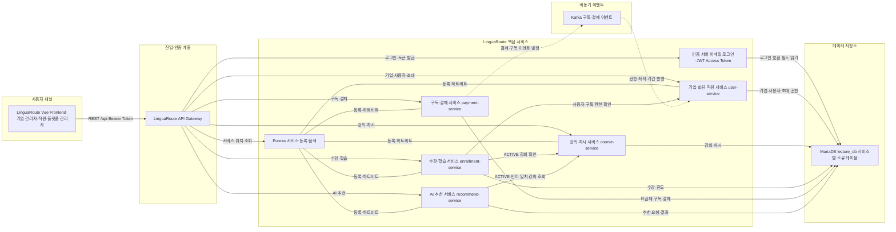
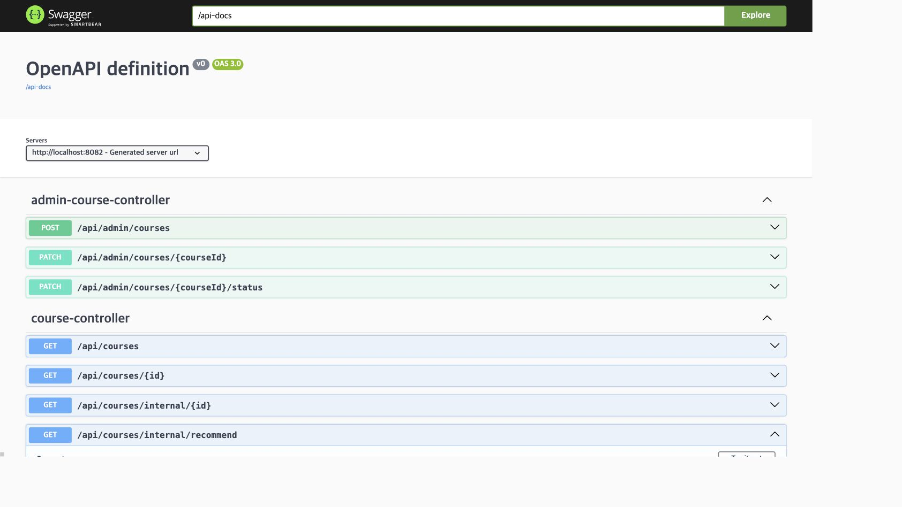

# LinguaRoute 서비스 기획서

> 문서 상태: MVP 기획 확정안

| 항목 | 내용 |
| --- | --- |
| 과목 | Agile & MSA 실습 팀과제 |
| 소속 | 광주 3반 6조 |
| 팀원 | 임해안, 박건우, 김주오, 성가연, 김지민 |
| 서비스명 | LinguaRoute |
| 발표 논리 | 왜(Pain Point) → 무엇을(AI 솔루션) → 어떻게 나눠서(스프린트) → 어떻게 구현(아키텍처·API) → 결과(동작 화면) |

## 1. 프로젝트 개요

### 1.1 서비스명

가칭 `LinguaRoute`

### 1.2 한 줄 소개

기업이 월간 또는 연간 구독권을 구매하면 소속 직원이 외국어 강의를 수강할 수 있고, AI가 직원의 언어, 수준, 직무, 상황 및 학습 목표를 분석하여 실제 등록된 강의 중 적합한 과정을 추천하는 B2B 교육 플랫폼입니다.

### 1.3 서비스 유형

본 서비스는 기업이 구독료를 결제하고 소속 직원이 교육을 이용하는 B2B2E 형태의 B2B 서비스입니다.

```text
플랫폼 → 기업 구독 → 직원 초대 → 직원 강의 수강
```

### 1.4 핵심 가치

- 기업 관리자는 하나의 구독으로 직원 계정과 교육 이용 권한을 관리할 수 있습니다.
- 직원은 자신의 조건에 맞는 강의를 직접 검색하거나 AI 추천을 통해 찾을 수 있습니다.
- 플랫폼 관리자는 기업, 사용자, 결제, 수강 및 강의 상태를 통합적으로 확인할 수 있습니다.

### 1.5 기존 코드의 위치

현재 저장소의 기본 코드는 강사가 제공한 실습용 출발점입니다. 기존 구현을 최종 요구사항으로 간주하지 않으며, 이 기획서와 [API 명세서](./api-spec.md), [ERD](./erd.md)를 목표 설계로 삼아 단계적으로 수정·확장합니다.

구현 우선순위는 다음과 같습니다.

1. 이 문서의 확정 MVP 기능
2. API 명세서의 Method, URL, Request, Response, 권한 및 상태 코드
3. ERD의 서비스별 데이터 소유권, 논리 참조, 제약조건 및 이벤트
4. 기존 강사 제공 코드

문서와 기존 코드가 다르면 기존 코드에 맞춰 요구사항을 축소하지 않습니다. 차이를 먼저 기록하고 MVP 범위에 맞게 구현 계획을 세웁니다.

---

## 2. 사용자와 권한

| 사용자 | 역할 코드 | 주요 책임 |
| --- | --- | --- |
| 플랫폼 관리자 | `PLATFORM_ADMIN` | 기업·사용자·강의·결제·수강 상태 운영 |
| 기업 관리자 | `COMPANY_ADMIN` | 기업 정보, 구독, 결제, 직원 초대와 좌석 관리 |
| 직원 | `EMPLOYEE` | 강의 조회, 수강신청, 학습과 AI 추천 사용 |

기업 대표자가 월간 또는 연간 정기권을 결제하면 구매 좌석 수에 따라 직원을 초대할 수 있습니다. 직원은 일회용 초대코드로 가입하며, 잔여 좌석이 없거나 구독이 비활성 상태이면 가입할 수 없습니다.

MVP 인증은 자체 이메일·비밀번호 로그인 뒤 Auth Server의 OAuth2 Authorization Code 흐름으로 JWT Access Token을 발급받습니다. 소셜 로그인은 사용하지 않습니다. Auth Server가 Refresh Token을 반환할 수 있으나 MVP 프론트엔드는 저장·갱신에 사용하지 않고, Access Token 만료 시 다시 로그인합니다.

인증 서버는 이메일·비밀번호를 검증하고 JWT Access Token을 발급합니다. `user-service`는 공용 `users` 테이블, 비밀번호 해시, 이메일 인증, 아이디 찾기, 비밀번호 변경·재설정, 기업·사용자 프로필과 비즈니스 역할을 담당합니다. 인증 서버는 같은 `users` 테이블의 로그인 필드를 읽습니다.

아이디 찾기는 이름과 기업 사업자번호로 계정을 조회한 뒤 등록된 로그인 이메일로만 안내 메일을 발송합니다. 화면에는 이메일이나 계정 존재 여부를 표시하지 않습니다.

```text
기업 관리자 로그인
→ 구독권 결제
→ 일회용 초대코드 생성·전달
→ 직원이 초대코드로 회원가입
→ 구독 상태와 잔여 좌석 검사
→ 직원 계정 생성 및 좌석 배정
```

---

## 3. 이해관계자와 Pain Point

### 3.1 기업 관리자

| Pain Point | 서비스가 제공하는 가치 |
| --- | --- |
| 기업별 직원 계정을 개별적으로 생성하고 관리하기 어려움 | 일회용 초대코드로 소속 직원이 직접 계정을 생성 |
| 계약 인원보다 많은 직원의 사용을 통제하기 어려움 | 구독 요금제의 좌석 제한에 따라 직원 가입 제한 |
| 결제와 이용 현황을 한곳에서 확인하기 어려움 | 결제 내역, 구독 상태, 만료일, 갱신일과 좌석 사용량 제공 |
| 직원의 수강 상태를 확인하기 어려움 | 소속 직원별 수강 상태 조회 제공 |

### 3.2 직원

| Pain Point | 서비스가 제공하는 가치 |
| --- | --- |
| 많은 강의 중 자신에게 맞는 과정을 찾기 어려움 | 언어, 상황, 난이도 필터와 AI 추천 제공 |
| 직무와 목표에 적합한 강의를 판단하기 어려움 | 입력 조건을 분석한 추천 이유 제공 |
| 신청 강의와 학습 진행 상태를 확인하기 어려움 | 신청 목록, 차시 목록과 진도율 제공 |

### 3.3 플랫폼 관리자

| Pain Point | 서비스가 제공하는 가치 |
| --- | --- |
| 기업, 사용자, 결제와 수강 상태가 분산됨 | 운영 화면에서 주요 상태 통합 조회 |
| 제공하지 않는 강의가 노출될 수 있음 | 강의 등록·수정 및 활성·비활성 상태 관리 제공 |
| 주요 운영 작업의 처리 이력을 확인하기 어려움 | 추후 감사 로그 기능으로 처리 이력 조회 확장 |

---

## 4. 핵심 사용자 흐름

### 4.1 기업 관리자

```text
기업 대표계정 회원가입
→ 로그인
→ 요금제 조회
→ 구독권 결제
→ 초대코드 생성·전달
→ 직원·좌석·수강 상태 관리
```

### 4.2 직원 기본 수강

```text
초대코드로 회원가입
→ 로그인
→ 강의 검색·필터
→ 강의 상세 조회
→ 수강신청
→ 차시 학습
→ 진도율 및 완료 상태 확인
```

### 4.3 직원 AI 추천

```text
로그인
→ 언어·수준·직무·상황·목표 입력
→ AI 추천 및 추천 이유 확인
→ 추천 강의 상세 조회
→ 수강신청
```

### 4.4 마이페이지

- 내 정보 조회·수정
- 비밀번호 변경
- 신청한 강의와 수강 상태 조회

---

## 5. 확정 MVP 기능 — [진행 체크리스트](./mvp-checklist.md)

기능별 구현 진행 상황은 [MVP 체크리스트](./mvp-checklist.md)에서 관리합니다.

### 5.1 인증·기업 계정·구독·직원·운영

| 영역 | 사용자 | 기능 |
| --- | --- | --- |
| 인증 | 전체 사용자 | 이메일 인증 |
| 약관 | 전체 사용자 | 회원가입 시 이용약관·개인정보 수집 동의 |
| 기업 계정 | 기업 관리자 | 기업 대표계정 회원가입 |
| 기업 계정 | 기업 관리자 | 로그인·로그아웃 |
| 인증 | 전체 사용자 | 아이디 찾기 |
| 기업 계정 | 기업 관리자 | 기업 정보 조회·수정 |
| 구독 | 기업 관리자 | 월간·연간 요금제 조회 |
| 구독 | 기업 관리자 | 구독권 결제 |
| 구독 이벤트 | 시스템 | `PaymentCompleted` 발행·처리 |
| 구독 | 시스템 | 결제 중복 처리 방지 |
| 구독 이벤트 | 시스템 | `PaymentFailed` 발행·처리 |
| 구독 이벤트 | 시스템 | `SubscriptionCanceled` 발행·처리 |
| 구독 이벤트 | 시스템 | `SubscriptionExpired` 발행·처리 |
| 구독 이벤트 | 시스템 | `SubscriptionRenewed` 발행·처리 |
| 구독 | 기업 관리자 | 결제 내역 조회 |
| 구독 | 기업 관리자 | 구독 상태 조회 |
| 구독 | 시스템 | 구독 만료일·갱신일 관리 |
| 구독 | 기업 관리자 | 구독 해지 |
| 직원 초대 | 기업 관리자 | 일회용 초대코드 생성 |
| 직원 초대 | 기업 관리자 | 초대코드 복사·전달 |
| 직원 초대 | 기업 관리자 | 초대코드 목록·상태 조회 |
| 직원 초대 | 기업 관리자 | 초대코드 폐기·재발급 |
| 직원 초대 | 시스템 | 초대코드 유효성·만료일 검사 |
| 직원 초대 | 시스템 | 초대코드 중복 사용 방지 |
| 직원 초대 | 시스템 | 요금제의 직원 인원 제한 검사 |
| 직원 관리 | 기업 관리자 | 소속 직원 목록 조회 |
| 직원 관리 | 기업 관리자 | 직원 비활성화·소속 해제 |
| 직원 관리 | 시스템 | 직원 좌석 배정·회수 |
| 직원 관리 | 기업 관리자 | 구매·사용·잔여 좌석 조회 |
| 직원 계정 | 직원 | 초대코드를 이용한 회원가입 |
| 직원 계정 | 직원 | 로그인·로그아웃 |
| 마이페이지 | 전체 사용자 | 내 정보 조회·수정 |
| 마이페이지 | 전체 사용자 | 비밀번호 변경·재설정 |
| 마이페이지 | 전체 사용자 | 회원 탈퇴 |
| 운영 | 플랫폼 관리자 | 사용자·기업·결제·수강 상태 조회 |

### 5.2 강의·수강·학습

| 영역 | 사용자 | 기능 |
| --- | --- | --- |
| 강의 | 직원 | 강의 목록 조회 |
| 강의 | 직원 | 강의 상세 조회 |
| 강의 | 직원 | 강의명 검색 |
| 강의 | 직원 | 언어별 필터 |
| 강의 | 직원 | 상황별 필터 |
| 강의 | 직원 | 난이도별 필터 |
| 강의 | 시스템 | 구독 권한에 따른 수강 가능 여부 확인 |
| 강의 관리 | 플랫폼 관리자 | 강의 등록·수정·활성·비활성 상태 관리 |
| 강의 관리 | 플랫폼 관리자 | 강의 차시 등록 |
| 수강신청 | 직원 | 개별 강의 수강신청 |
| 수강신청 | 시스템 | 중복 수강신청 방지 |
| 수강신청 | 직원 | 신청한 강의 목록 조회 |
| 수강 관리 | 직원 | 강의 차시 목록 조회 |
| 수강 관리 | 직원 | 선택한 차시 수강 |
| 수강 관리 | 직원 | 차시 완료 처리 |
| 수강 관리 | 시스템 | 진도율 서버 계산·저장 |
| 수강 관리 | 시스템 | 수강 완료 처리 |
| 수강 관리 | 시스템 | 학습 시작·완료 시각 저장 |
| 수강 관리 | 기업 관리자 | 직원별 수강 상태 조회 |
| 수강 관리 | 기업 관리자 | 직원별 진도율 조회 |

### 5.3 AI 추천

| 사용자 | 기능 |
| --- | --- |
| 직원 | 언어·수준·직무·상황·목표 입력 |
| 시스템 | 직원 정보 기반 강의 추천 |
| 시스템 | 강의 추천 이유 제공 |
| 시스템 | 실제 등록되어 활성화된 강의만 추천 |
| 시스템 | 선택한 언어로 개설된 강의만 추천 |
| 시스템 | 추천 실패·AI 장애 시 규칙 기반 대체 결과 제공 |
| 직원 | 추천 강의 상세 화면 이동 |
| 직원 | 추천 강의 수강신청 |

---

## 6. 선택 기능

현재 선택 기능은 없습니다.

---

## 7. 제외 기능

다음 기능은 현재 프로젝트에서 구현하지 않습니다.

| 영역 | 사용자 | 기능 |
| --- | --- | --- |
| 구독 | 기업 관리자 | 환불 요청 |
| AI 추천 | 직원 | 추천 거부 |
| AI 추천 | 시스템 | 거부 이유를 반영한 재추천 |
| 강의 관리 | 플랫폼 관리자 | 언어별 강의 버전 관리 |
| 수강 관리 | 직원 | 최근 학습 위치 저장·이어보기 |

---

## 8. 추후 확장 기능

| 영역 | 사용자 | 기능 |
| --- | --- | --- |
| 음성교육 | 직원 | STT 기반 말하기 인식 |
| 음성교육 | 직원 | TTS 기반 듣기 학습 |
| 음성교육 | 시스템 | 발음·문법 피드백 |
| 운영 | 시스템 | 주요 작업 감사 로그 |

---

## 9. AI 추천 설계

### 9.1 입력

| 입력 항목 | 예시 |
| --- | --- |
| 학습 언어 | 영어 |
| 현재 수준 | 중급 |
| 직무 | 해외영업 |
| 사용 상황 | 해외 고객 미팅 |
| 학습 목표 | 제품을 자연스럽게 설명하고 싶음 |

### 9.2 처리

```text
직원 조건 입력
→ recommend-service가 조건 분석
→ recommend-service가 course-service에서 활성 강의 조회
→ 선택 언어와 일치하는 강의만 필터링
→ 추천 이유와 함께 결과 반환
```

`recommend-service`는 추천 요청과 추천 결과를 소유합니다. AI는 존재하지 않는 강의를 새로 만들어 추천하지 않으며, `course-service` API를 통해 실제 등록된 `ACTIVE` 강의이면서 직원이 선택한 언어와 일치하는지 검증합니다. AI 호출이 실패하면 규칙 기반 대체 추천을 반환합니다.

### 9.3 결과 예시

추천 결과는 강의 식별자, 제목, 언어, 수준과 추천 이유를 제공합니다. 실제 요청·응답 형식과 장애 시 대체 응답은 [API 명세서의 AI 강의 추천 API](./api-spec.md#9-ai-강의-추천-api)를 따릅니다.

---

## 10. 팀 담당 영역

| 팀원 | 담당 영역 | 담당 서비스 | 핵심 책임 |
| --- | --- | --- | --- |
| 임해안 | 기업·회원·직원 관리 | `user-service` | 기업계정, 직원계정, 초대코드, 좌석 |
| 김주오 | 강의·차시 관리 | `course-service` | 강의 CRUD, 검색, 필터, 차시 |
| 성가연 | 수강·학습 관리 | `enrollment-service` | 수강신청, 진도율, 완료 처리 |
| 박건우 | 구독·결제·프론트엔드 | `payment-service`, Kafka, `vue-frontend` | 요금제, 구독, 결제, 이벤트, 프론트엔드 |
| 김지민 | AI 추천·통합 | `recommend-service` | AI 추천, Gateway 연동, 통합 테스트 |

담당 영역이 달라도 서비스 간 계약이 바뀌는 작업은 관련 담당자와 API·이벤트 형식을 함께 확인합니다.

---

## 11. 확정 구현 방침

- 데이터베이스는 현재 Docker Compose와 동일하게 MariaDB 한 개와 `lecture_db` 한 개를 유지하며 서비스별 소유 테이블만 추가·변경합니다.
- 서버를 추가하지 않고 현재 Docker Compose의 서비스 수와 MariaDB 한 개를 유지합니다.
- 인증 서버는 이메일·비밀번호 로그인과 OAuth2 Authorization Code 기반 JWT Access Token 발급을 담당합니다. 소셜 로그인은 사용하지 않으며, 추가 인증 기능과 비밀번호 관리는 `user-service`에 구현합니다.
- 기존 Auth Server 호환을 위해 `EMPLOYEE`는 `users.role=STUDENT`, `COMPANY_ADMIN`과 `PLATFORM_ADMIN`은 `users.role=INSTRUCTOR`로 저장합니다. 실제 서비스 권한은 새 `business_role` 컬럼으로 관리합니다.
- 기존 API Gateway 서버는 유지합니다. 제공 Gateway 이미지는 수정하지 않고, `docker-compose.yml` 환경변수로 가능한 라우팅만 보정합니다. 공개 허용 경로가 이미지에 고정된 경우에는 그 경로를 외부 MVP 계약에 맞춰 사용합니다.
- 이메일 인증은 SMTP로 6자리 코드를 보내고 비밀번호 재설정은 SMTP 링크로 처리하며, 세부 보안 정책은 API 명세를 따릅니다.
- 수강신청 시 `enrollment-service`가 `user-service`의 내부 구독 권한 API를 동기 호출하며, 호출 실패 시 신청을 허용하지 않습니다.
- 실제 PG 없이 모의 결제와 구독 기간·갱신·만료를 구현합니다.
- AI는 강의 추천과 규칙 기반 대체 결과만 제공하며 추가 AI 도구 라우팅은 구현하지 않습니다.

개발은 다음 순서로 시작합니다.

1. 인증 서버의 이메일·비밀번호 로그인과 현재 `users` 테이블 호환성을 유지합니다.
2. 제공 API Gateway 이미지는 수정하지 않고 `docker-compose.yml` 환경변수로 가능한 라우팅만 보정하며, 이미지에 고정된 공개 경로와 충돌하는 API는 Gateway 허용 경로에 맞춰 외부 계약을 정리합니다.
3. `user-service`에 인증 보조 기능과 비즈니스 역할을 추가하고 각 서비스 API를 구현합니다.
4. 내부 구독 권한 조회와 Kafka 구독 이벤트를 연동합니다.
5. 프론트엔드를 Gateway 경로에 연결하고 전체 사용자 흐름을 통합 테스트합니다.

---

## 12. MVP 완료 기준

- 확정 MVP의 사용자 흐름이 API Gateway를 통해 실행됩니다.
- 역할과 기업 소속에 따른 접근 제어가 적용됩니다.
- 회원가입 전에 이메일 인증이 완료되고 필수 약관 동의가 저장됩니다.
- 구독 상태와 좌석 한도가 직원 가입과 수강 권한에 반영됩니다.
- 강의 검색·필터, 수강신청, 차시 완료와 진도율 계산이 실제 데이터로 동작합니다.
- 결제 중복 방지와 결제 결과 이벤트가 검증됩니다.
- 결제 실패·구독 해지·만료·갱신 이벤트가 중복 수신에도 안전하게 처리됩니다.
- AI 추천은 실제 `ACTIVE` 강의만 반환하고 장애 시 대체 결과를 제공합니다.
- Swagger의 실제 API가 [API 명세서](./api-spec.md)와 일치합니다.
- 구현된 엔티티와 서비스 간 참조가 [ERD](./erd.md)와 일치합니다.
- 필수 테스트와 통합 실행 결과가 Pull Request에 기록됩니다.

---

## 13. 조별 발표 기획서

이 장은 과제에서 요구한 여섯 단계를 발표 순서대로 정리한 제출용 본문입니다. LinguaRoute에는 강사·판매자 역할이 없으므로 도메인 매핑에서 정의한 `기업 관리자`, `직원`, `플랫폼 관리자`를 핵심 이해관계자로 사용합니다.

### 13.1 이해관계자 가치(Pain Point) — 왜 필요한가

#### 문제 정의

| 이해관계자 | 실제 Pain Point | 왜 중요한가 | 해결 후 기대 가치 |
| --- | --- | --- | --- |
| 기업 관리자 | 직원 계정 생성, 좌석 통제, 결제와 학습 현황이 여러 업무로 분산됨 | 교육 운영 시간이 증가하고 계약 인원 초과, 미사용 좌석, 학습 성과 누락이 발생할 수 있음 | 구독·좌석·초대·직원별 진도를 한 화면에서 관리 |
| 직원 | 많은 강의 중 현재 직무와 업무 상황에 맞는 강의를 판단하기 어려움 | 강의 탐색 시간이 길어지고 적합하지 않은 강의 신청으로 학습 몰입도가 낮아짐 | 언어·수준·직무·상황·목표 기반의 빠른 강의 탐색과 학습 |
| 플랫폼 관리자 | 기업, 사용자, 강의, 결제와 수강 상태가 서비스별로 흩어짐 | 장애·결제 실패·비활성 강의를 늦게 발견하면 고객사 운영에 직접 영향을 줌 | 전체 기업의 핵심 상태와 예외 상황을 통합 운영 |

#### 핵심 문제 문장

> 기업은 교육 이용 권한과 성과를 통제하기 어렵고, 직원은 자신에게 맞는 강의를 찾기 어려우며, 플랫폼 운영자는 분산된 상태를 한눈에 파악하기 어렵습니다.

이 문제를 해결하려면 단순 강의 목록이 아니라 `기업 구독 → 직원 초대 → 맞춤 강의 탐색 → 수강·학습 → 기업 성과 확인`이 하나의 서비스 흐름으로 연결되어야 합니다.

### 13.2 이를 해결하기 위한 AI 솔루션 — 무엇을 제공하는가

LinguaRoute는 기업이 비용을 지불하고 소속 직원이 학습하는 B2B2E 구독 플랫폼입니다. AI는 서비스 전체를 대신하지 않고, 직원의 조건을 실제 강의와 연결하는 추천 판단을 담당합니다.

| Pain Point | 핵심 기능 | AI의 역할 | 검증 기준 |
| --- | --- | --- | --- |
| 기업의 계정·좌석 통제 어려움 | 월간·연간 구독, 모의 결제, 일회용 초대코드, 좌석 배정·회수 | AI 사용 없음. 서버 규칙으로 구독과 좌석을 통제 | 구독이 `ACTIVE`이고 잔여 좌석이 있을 때만 직원 가입·수강 허용 |
| 직원의 강의 탐색 어려움 | 언어·상황·난이도 검색과 AI 강의 추천 | 언어, 수준, 직무, 상황, 목표를 분석해 후보 강의와 추천 이유 생성 | `course-service`에 등록된 동일 언어의 `ACTIVE` 강의만 최종 반환 |
| AI 장애 시 학습 중단 위험 | 규칙 기반 대체 추천 | AI 호출 실패 시 언어·수준·상황 일치도를 기준으로 대체 결과 구성 | 응답의 `source`를 `RULE_BASED_FALLBACK`으로 명시 |
| 기업의 학습 성과 파악 어려움 | 직원별 수강 상태와 서버 계산 진도율 | Sprint 1에서는 AI 분석 대상이 아님 | 완료 차시 수를 기준으로 서버가 진도율 계산 |
| 플랫폼의 운영 상태 분산 | 기업·사용자·강의·결제·수강 운영 화면 | Sprint 1에서는 AI 분석 대상이 아님 | 역할별 관리자 API를 통해 상태와 예외 조회 |

AI 추천 처리 흐름은 다음과 같습니다.

```text
직원이 언어·수준·직무·상황·목표 입력
→ recommend-service가 조건 분석
→ course-service에서 실제 ACTIVE 강의 조회
→ 요청 언어와 일치하는 강의만 검증
→ 강의 ID와 추천 이유 반환
→ AI 장애 시 규칙 기반 대체 결과 반환
```

### 13.3 스프린트 구분 — 어떻게 나눠서 구현하는가

#### Sprint 1: 핵심 가치 검증용 MVP

| 우선순위 | 에픽 | 구현 범위 | 선정 이유 |
| --- | --- | --- | --- |
| P0 | 인증·기업 가입 | 이메일·비밀번호 로그인, JWT Access Token, 이메일 인증, 필수 약관, 기업 대표계정·직원 가입, 역할·소속 검증 | 모든 B2B 데이터 격리와 역할별 흐름의 출발점 |
| P0 | 구독·결제·권한 | 요금제, 월간·연간 구독, 모의 결제, 멱등성, 해지·만료·갱신, Kafka 결제 이벤트 | 기업이 비용을 내고 직원에게 권한을 제공하는 수익 모델의 핵심 |
| P0 | 초대·좌석·직원 | 일회용 초대코드, 만료·중복 방지, 좌석 배정·회수, 직원 상태 관리 | B2B 계약 인원 통제를 검증하는 핵심 기능 |
| P0 | 강의·수강·학습 | 강의 검색·필터·상세, 수강신청, 중복 방지, 차시 시작·완료, 진도율 | 직원이 실제 교육 가치를 얻는 최소 학습 흐름 |
| P1 | AI 추천 (개발 중) | 조건 입력, 추천 이유, 실제 `ACTIVE` 강의 검증, 규칙 기반 대체 | LinguaRoute의 차별화 가치이나 Gateway 통합 계약 정비가 남아 있음 |
| P1 | 역할별 운영 화면 | 기업 관리자 대시보드·진도·구독·직원 관리, 플랫폼 관리자 통합 조회 | 플랫폼 관리자 사용자·기업 조회 API는 구현·Gateway 검증 완료. 결제·수강 조회 API와 운영 화면 라이브 연동은 남아 있음 |

현재 Sprint 1의 구현 완료 기준은 `기업 구독 → 직원 초대 → 직원 가입 → 수강신청 → 학습 완료 → 기업 진도 확인`이 API Gateway를 통해 한 흐름으로 동작하는 것입니다. AI 추천과 플랫폼 운영 조회는 확정 MVP 목표이지만, 구현·통합 검증 전에는 이 완료 기준에 포함하지 않습니다.

#### Sprint 2: 학습 경험과 운영 고도화

| 에픽 | 확장 기능 | Sprint 2로 분리한 이유 |
| --- | --- | --- |
| 음성 학습 | STT 기반 말하기 인식 | 음성 입력 품질, 외부 모델 연동과 비용 검증이 필요함 |
| 듣기 학습 | TTS 기반 듣기 콘텐츠 | 언어별 음성 품질과 콘텐츠 정책을 별도로 검증해야 함 |
| AI 피드백 | 발음·문법 피드백 | 충분한 학습 데이터와 평가 기준이 먼저 필요함 |
| 운영 추적 | 주요 작업 감사 로그 | 핵심 거래 흐름을 먼저 안정화한 뒤 추적 범위를 확정해야 함 |

환불, 추천 거부·재추천, 언어별 강의 버전, 최근 학습 위치 저장·이어보기는 Sprint 2가 아니라 현재 프로젝트의 **제외 기능**입니다. 상세 범위는 [제외 기능](#7-제외-기능)과 [추후 확장 기능](#8-추후-확장-기능)을 따릅니다.

### 13.4 아키텍처 구성도 — 어떻게 구현하는가

#### LinguaRoute MSA 구성도



#### 서비스별 책임

| 과제 제공 구조 | LinguaRoute에서의 이름 | 핵심 책임 |
| --- | --- | --- |
| Auth Server | LinguaRoute 인증 서버 | 이메일·비밀번호 검증, JWT Access Token 발급 |
| API Gateway | LinguaRoute API Gateway | 모든 외부 `/api` 요청의 단일 진입점과 서비스 라우팅 |
| Eureka | LinguaRoute 서비스 레지스트리 | 서비스 인스턴스 등록과 탐색 |
| `user-service` | 기업·회원·직원 서비스 | 기업, 사용자, 이메일 인증, 약관, 초대, 좌석, 최신 구독 권한 |
| `course-service` | 강의·차시 서비스 | 강의·차시 등록, 검색, 필터, `ACTIVE` 상태 관리 |
| `enrollment-service` | 수강·학습 서비스 | 수강신청, 차시 시작·완료, 서버 진도율 계산 |
| `payment-service` | 구독·결제 서비스 | 요금제, 구독, 모의 결제, 멱등성, 이벤트 발행 |
| `recommend-service` | AI 추천 서비스 | 추천 조건 분석, 추천 이유, 실제 강의 검증, 대체 추천 |
| Kafka | 구독·결제 이벤트 버스 | 결제 완료·실패와 구독 해지·만료·갱신 상태 전달 |

MariaDB는 한 개를 사용하지만 각 서비스는 자신의 테이블만 접근합니다. 서비스 간 다른 데이터가 필요하면 REST API를 호출하고, 결제·구독 상태 전달은 Kafka 이벤트를 사용합니다. 상세 데이터 소유권과 이벤트 payload는 [ERD](./erd.md)를 따릅니다.

### 13.5 API 명세 — 프론트엔드가 무엇을 호출하는가

모든 보호 API는 `Authorization: Bearer {accessToken}`을 사용하고, 프론트엔드는 API Gateway의 `/api` 경로만 호출합니다. 아래 표는 발표에서 설명할 핵심 엔드포인트이며 전체 계약은 [API 명세서](./api-spec.md)가 원본입니다.

#### 프론트엔드 핵심 호출 목록

| 화면·기능 | Method | URL | 권한 | Request 핵심 | Response 핵심 |
| --- | --- | --- | --- | --- | --- |
| 로그인 | `GET`·`POST` | `/oauth2/authorize` → `/oauth2/token` | 공개 | Auth Server 이메일·비밀번호 세션, Authorization Code | JWT `access_token`, `expires_in` |
| 기업 회원가입 | `POST` | `/api/users/register` | 공개 | 기업·관리자·이메일 인증·약관 | `companyId`, `userId`, `COMPANY_ADMIN` |
| 직원 회원가입 | `POST` | `/api/employees/signup` | 공개 | 초대코드·직원·이메일 인증·약관 | 직원 계정과 좌석 배정 결과 |
| 내 정보 | `GET`, `PATCH` | `/api/users/me` | 로그인 | 수정 시 이름 등 | 사용자·역할·기업 정보 |
| 기업 정보 | `GET`, `PATCH` | `/api/companies/me` | 기업 관리자 | 수정 기업 정보 | 자신의 기업 정보 |
| 요금제 | `GET` | `/api/plans` | 기업 관리자 | 없음 | 가격, 결제 주기, 좌석 수 |
| 구독 결제 | `POST` | `/api/subscriptions` | 기업 관리자 | `planPriceId`, `paymentMethodToken`, `Idempotency-Key` | 구독·결제 ID, `ACTIVE`, 이용 기간 |
| 구독 조회·해지 | `GET`, `POST` | `/api/subscriptions/me`, `/api/subscriptions/me/cancel` | 기업 관리자 | 해지 사유 | 상태, 만료일, 자동 갱신 여부 |
| 결제 내역 | `GET` | `/api/payments` | 기업 관리자 | 없음 | 결제 금액·일시·상태 |
| 초대코드 | `POST`, `GET` | `/api/companies/me/invitations` | 기업 관리자 | `expiresInDays` | 코드, 상태, 만료일 |
| 초대 폐기·재발급 | `DELETE`, `POST` | `/api/companies/me/invitations/{id}`, `/api/companies/me/invitations/{id}/reissue` | 기업 관리자 | 초대 ID | 폐기 또는 새 코드 |
| 직원·좌석 | `GET` | `/api/companies/me/employees`, `/api/companies/me/seats` | 기업 관리자 | 검색·상태 조건 | 직원 목록, 구매·사용·잔여 좌석 |
| 기업 학습 현황 | `GET` | `/api/companies/me/enrollments/progress` | 기업 관리자 | 직원·상태 조건 | 직원별 강의와 진도율 |
| 강의 검색 | `GET` | `/api/courses` | 직원 | `keyword`, `language`, `situation`, `level`, `page` | `ACTIVE` 강의 페이지 |
| 강의 상세·차시 | `GET` | `/api/courses/{courseId}`, `/api/courses/{courseId}/lessons` | 직원 | 강의 ID | 강의 정보와 차시 목록 |
| 수강신청 | `POST` | `/api/enrollments` | 직원 | `courseId` | `enrollmentId`, `ENROLLED`, 진도율 |
| 내 학습 | `GET` | `/api/enrollments/me` | 직원 | 상태 조건 | 신청 강의와 학습 상태 |
| 차시 시작·완료 | `POST` | `/api/enrollments/{enrollmentId}/lessons/{lessonId}/start`, `/complete` | 직원 | 경로 ID | 차시 상태와 서버 계산 진도율 |
| AI 추천 (개발 중) | `POST` | `/api/courses/recommendations` | 직원 | 언어·수준·직무·상황·목표 | 목표 계약. 구현·통합 검증 후 라이브 호출 |
| 강의 관리 | `POST`, `PATCH` | `/api/admin/courses`, `/api/admin/courses/{courseId}` | 플랫폼 관리자 | 강의 정보 | 생성·수정된 강의 |
| 플랫폼 운영 (부분 구현·화면 목업) | `GET` | `/api/admin/users`, `/api/admin/companies`, `/api/admin/payments`, `/api/admin/enrollments` | 플랫폼 관리자 | 검색·상태 조건 | 사용자·기업 API는 구현·Gateway 검증 완료. 결제·수강 API 및 화면 연동은 남아 있음 |

#### Request/Response 예시 1 — 구독 결제

```http
POST /api/subscriptions
Authorization: Bearer {accessToken}
Idempotency-Key: 1e7f52d5-c0d5-4a86-aefe-3334f664ee65
Content-Type: application/json
```

```json
{
  "planPriceId": 1,
  "paymentMethodToken": "mock-success"
}
```

```json
{
  "data": {
    "subscriptionId": 7001,
    "paymentId": 8001,
    "status": "ACTIVE",
    "currentPeriodEnd": "2026-09-10T10:30:00+09:00"
  }
}
```

#### Request/Response 예시 2 — 수강신청

```http
POST /api/enrollments
Authorization: Bearer {accessToken}
Content-Type: application/json
```

```json
{
  "courseId": 12
}
```

```json
{
  "data": {
    "enrollmentId": 9001,
    "courseId": 12,
    "status": "ENROLLED",
    "progressRate": 0
  }
}
```

#### Request/Response 예시 3 — AI 강의 추천 목표 계약

```http
POST /api/courses/recommendations
Authorization: Bearer {accessToken}
Content-Type: application/json
```

```json
{
  "language": "ENGLISH",
  "level": "INTERMEDIATE",
  "job": "GLOBAL_SALES",
  "situation": "CUSTOMER_MEETING",
  "goal": "제품을 자연스럽게 설명하고 싶음"
}
```

```json
{
  "data": {
    "recommendationId": 3001,
    "source": "AI",
    "courses": [
      {
        "courseId": 12,
        "title": "해외 고객 미팅 영어",
        "reason": "해외영업 직무와 고객 미팅 목표에 적합합니다."
      }
    ]
  }
}
```

#### Swagger 검증 상태

2026-08-11 Java 21로 로컬 실행한 `course-service` Swagger에서 기존 내부 경로인 `GET /api/courses/internal/recommend?language=ENGLISH`를 직접 실행하여 `200 OK`와 JSON 응답을 확인했습니다. 이후 내부 API 보안 기준을 반영하여 목표 내부 경로는 `GET /internal/courses/recommend?language=ENGLISH`로 변경되었습니다. 보호 API인 `GET /api/courses`는 인증 토큰 없이 직접 호출하면 `401 Unauthorized`가 반환됩니다. 따라서 다음처럼 구분합니다.

| 구분 | 상태 |
| --- | --- |
| 과거 실행 확인 | `GET http://localhost:8082/api/courses/internal/recommend?language=ENGLISH` → `200 OK` |
| 현재 목표 내부 경로 | `GET http://localhost:8082/internal/courses/recommend?language=ENGLISH` + `X-Internal-Api-Key` |
| 확인된 실행 응답 | LinguaRoute 강의의 `language`, `situation`, `level`, `status` 구조 |
| 목표 발표 계약 | 이 장과 [API 명세서](./api-spec.md)의 LinguaRoute B2B 구독·학습 구조 |
| 남은 통합 확인 | Auth Server와 Gateway 이미지 준비 → 보호 API 인증 흐름 실행 → 프론트 `VITE_USE_LIVE_API=true` 연결 → 요청·응답 재캡처 |


실행 중인 Swagger가 노출한 현재 엔드포인트 목록은 다음 캡처와 같습니다.



### 13.6 동작 화면 스냅샷 — 구현 결과를 어떻게 보여주는가

현재 캡처는 최신 프론트 퍼블리싱을 `VITE_USE_LIVE_API=false`로 실행하여 브라우저에서 버튼과 상태 변화를 직접 조작한 **UI 프로토타입 증거**입니다. 실제 API 호출 증거는 바로 위 Swagger 캡처이며, 프론트와 전체 목표 API의 통합 완료를 의미하지 않습니다. AI 추천과 플랫폼 운영 화면은 구현·통합 검증 후 라이브 API 응답 캡처로 교체해야 합니다.

#### 화면 1 — B2B2E 서비스 소개

기업 관리자, 직원, 플랫폼 관리자의 세 관점을 하나의 서비스로 연결한다는 핵심 가치를 보여줍니다.


#### 화면 2 — 기업 구독 결제 전 → 결제 후

`POST /api/subscriptions`의 전후 상태를 설명하는 화면입니다. 결제 전에는 요금제·주기·좌석을 확인하고, 결제 후에는 `PaymentCompleted → 구독 ACTIVE → 좌석 50석` 변화를 보여줍니다.

| 요청 전 | 요청 후 |
| --- | --- |
|  |  |

#### 화면 3 — 직원 현황 → 초대코드 생성

`GET /api/companies/me/employees`와 `POST /api/companies/me/invitations` 목표 요청에 대응하는 직원 조회·일회용 코드 생성 흐름입니다.

| 요청 전 | 요청 후 |
| --- | --- |
|  |  |

#### 화면 4 — 강의 상세 → 수강신청 완료

직원이 강의 상세에서 기업 구독 권한과 강의 상태를 확인하고 `POST /api/enrollments` 성공 응답을 가정했을 때 버튼과 안내 문구가 바뀌는 장면입니다.

| 요청 전 | 요청 후 |
| --- | --- |
|  |  |

#### 화면 5 — AI 추천 결과

직원이 `영어·중급·글로벌 세일즈·고객 미팅`과 학습 목표를 입력한 뒤 `POST /api/courses/recommendations` 목표 응답에 대응하는 추천 강의와 추천 근거를 확인하는 장면입니다.


#### 화면 6 — 기업 관리자 학습 성과

`GET /api/companies/me/enrollments/progress` 목표 응답을 직원·부서별 진도율과 수료 현황으로 표현한 장면입니다.


#### 화면 7 — 플랫폼 관리자 운영

기업, 사용자, 결제, 수강과 예외 알림을 통합 조회하는 플랫폼 관리자 화면입니다.


#### 발표 시연 순서

```text
기업 관리자: 요금제 선택 → 모의 결제 성공 → 구독 ACTIVE·좌석 활성화
→ 기업 관리자: 초대코드 생성
→ 직원: 초대 가입 → AI 추천 조건 입력 → 추천 강의 확인
→ 직원: 강의 상세 → 수강신청 → 차시 완료 → 진도율 증가
→ 기업 관리자: 직원별 진도 확인
→ 플랫폼 관리자: 기업·결제·수강 운영 상태 확인
```

발표 화면에는 가능하면 브라우저의 Network 또는 Swagger 응답을 함께 배치하여 `요청 URL·상태 코드·응답 데이터·화면 변화`가 한 장에서 이어지도록 구성합니다.
