# LinguaRoute 조별 발표 기획서

## Agile & MSA 실습 팀과제

| 항목 | 내용 |
| --- | --- |
| 소속 | 광주 3반 6조 |
| 팀원 | 임해안 · 박건우 · 김주오 · 성가연 · 김지민 |
| 서비스명 | LinguaRoute |
| 서비스 유형 | 기업이 구독하고 소속 직원이 이용하는 B2B2E 외국어교육 플랫폼 |
| 핵심 흐름 | 왜 → 무엇을 → 어떻게 나눠서 → 어떻게 구현 → 결과 |

> 기업 구독부터 직원 초대, AI 강의 추천, 수강과 진도 관리까지 하나의 경로로 연결합니다.

## 1. 이해관계자 가치(Pain Point)

LinguaRoute에는 별도의 강사·판매자 역할이 없습니다. 도메인 매핑에서 정의한 기업 관리자, 직원, 플랫폼 관리자를 핵심 이해관계자로 사용합니다.

| 이해관계자 | 실제 불편함 | 왜 중요한가 | 제공 가치 |
| --- | --- | --- | --- |
| 기업 관리자 | 직원 계정 생성, 좌석 통제, 결제와 학습 현황이 여러 업무로 분산됨 | 계약 인원 초과, 미사용 좌석, 학습 성과 누락과 운영 시간 증가로 이어짐 | 구독·좌석·초대·직원별 진도를 한 화면에서 관리 |
| 직원 | 많은 강의 중 현재 직무와 업무 상황에 맞는 강의를 판단하기 어려움 | 탐색 시간이 길어지고 적합하지 않은 강의로 학습 몰입도가 낮아짐 | 검색 필터와 AI 추천으로 필요한 강의를 빠르게 발견 |
| 플랫폼 관리자 | 기업, 사용자, 강의, 결제와 수강 상태가 서비스별로 분산됨 | 결제 실패나 비활성 강의를 늦게 발견하면 고객사 운영에 직접 영향 | 전체 기업의 핵심 상태와 예외 상황을 통합 운영 |

### 핵심 문제 정의

기업은 교육 이용 권한과 성과를 통제하기 어렵고, 직원은 자신에게 맞는 강의를 찾기 어려우며, 플랫폼 운영자는 분산된 상태를 한눈에 파악하기 어렵습니다.

따라서 다음 과정이 하나의 서비스 흐름으로 연결되어야 합니다.

```text
기업 구독 → 직원 초대 → 직원 가입 → 맞춤 강의 탐색
→ 수강신청 → 차시 학습 → 진도 확인 → 기업 성과 관리
```

## 2. Pain Point를 해결하는 AI 솔루션

LinguaRoute는 기업이 비용을 지불하고 소속 직원이 학습하는 구독 플랫폼입니다. AI는 전체 업무를 대신하지 않고 직원의 조건을 실제 등록 강의와 연결하는 추천 판단을 담당합니다.

| Pain Point | 핵심 기능 | AI 역할 | 검증 기준 |
| --- | --- | --- | --- |
| 기업의 계정·좌석 통제 어려움 | 월간·연간 구독, 모의 결제, 일회용 초대코드, 좌석 배정·회수 | AI 사용 없음. 서버 규칙으로 통제 | 구독 `ACTIVE`와 잔여 좌석을 모두 확인 |
| 직원의 강의 탐색 어려움 | 언어·상황·난이도 검색과 AI 추천 | 언어, 수준, 직무, 상황, 목표를 분석 | 실제 동일 언어의 `ACTIVE` 강의만 반환 |
| AI 장애 시 학습 중단 위험 | 규칙 기반 대체 추천 | 언어·수준·상황 일치도로 대체 결과 생성 | `source=RULE_BASED_FALLBACK` 명시 |
| 기업의 성과 파악 어려움 | 직원별 수강 상태와 서버 계산 진도율 | Sprint 1에서는 AI 분석 대상 아님 | 완료 차시를 기준으로 서버 계산 |
| 플랫폼의 운영 상태 분산 | 역할별 운영 대시보드 | Sprint 1에서는 AI 분석 대상 아님 | 관리자 API로 상태와 예외 조회 |

### AI 추천 처리 과정

```text
직원이 언어·수준·직무·상황·목표 입력
→ recommend-service가 조건 분석
→ course-service에서 실제 ACTIVE 강의 조회
→ 요청 언어와 일치하는 강의만 최종 검증
→ 강의 ID와 추천 이유 반환
→ AI 장애 시 규칙 기반 대체 결과 반환
```

### AI 입력과 출력 예시

| 입력 | 값 |
| --- | --- |
| 언어 | 영어 |
| 수준 | 중급 |
| 직무 | 글로벌 세일즈 |
| 상황 | 해외 고객 미팅 |
| 목표 | 제품을 자연스럽게 설명하고 질문에 자신 있게 답하고 싶음 |

## 3. 스프린트 구분

### Sprint 1: 핵심 가치 검증 MVP

| 우선순위 | 에픽 | 구현 범위 | 선정 이유 |
| --- | --- | --- | --- |
| P0 | 인증·기업 가입 | 이메일·비밀번호 로그인, JWT Access Token, 이메일 인증, 약관, 기업·직원 가입, 역할·소속 검증 | 모든 B2B 데이터 격리와 역할별 흐름의 출발점 |
| P0 | 구독·결제·권한 | 요금제, 월간·연간 구독, 모의 결제, 멱등성, 해지·만료·갱신, Kafka 이벤트 | 기업이 비용을 내고 직원에게 권한을 제공하는 수익 모델의 핵심 |
| P0 | 초대·좌석·직원 | 일회용 초대코드, 만료·중복 방지, 좌석 배정·회수, 직원 상태 | 계약 인원 통제를 검증하는 B2B 핵심 기능 |
| P0 | 강의·수강·학습 | 검색·필터·상세, 수강신청, 중복 방지, 차시 완료, 진도율 | 직원이 실제 교육 가치를 얻는 최소 학습 흐름 |
| P0 | AI 추천 | 조건 입력, 추천 이유, 실제 강의 검증, 규칙 기반 대체 | 맞춤 강의 탐색이라는 서비스 차별화 가치 검증 |
| P1 | 역할별 운영 화면 | 기업 관리자와 플랫폼 관리자 대시보드 | 구매자와 운영자가 상태를 확인해야 B2B 운영이 완결됨 |

Sprint 1의 완료 기준은 다음 전체 흐름이 API Gateway를 통해 실행되는 것입니다.

```text
기업 구독 → 직원 초대 → 직원 가입 → AI 추천
→ 수강신청 → 학습 완료 → 기업 진도 확인
```

### Sprint 2: 학습 경험과 운영 고도화

| 에픽 | 확장 기능 | Sprint 2로 분리한 이유 |
| --- | --- | --- |
| 음성 학습 | STT 기반 말하기 인식 | 음성 입력 품질, 외부 모델 연동과 비용 검증 필요 |
| 듣기 학습 | TTS 기반 듣기 콘텐츠 | 언어별 음성 품질과 콘텐츠 정책 검증 필요 |
| AI 피드백 | 발음·문법 피드백 | 충분한 학습 데이터와 평가 기준이 먼저 필요 |
| 운영 추적 | 주요 작업 감사 로그 | 핵심 거래 흐름 안정화 후 추적 범위 확정 필요 |

## 4. LinguaRoute MSA 아키텍처

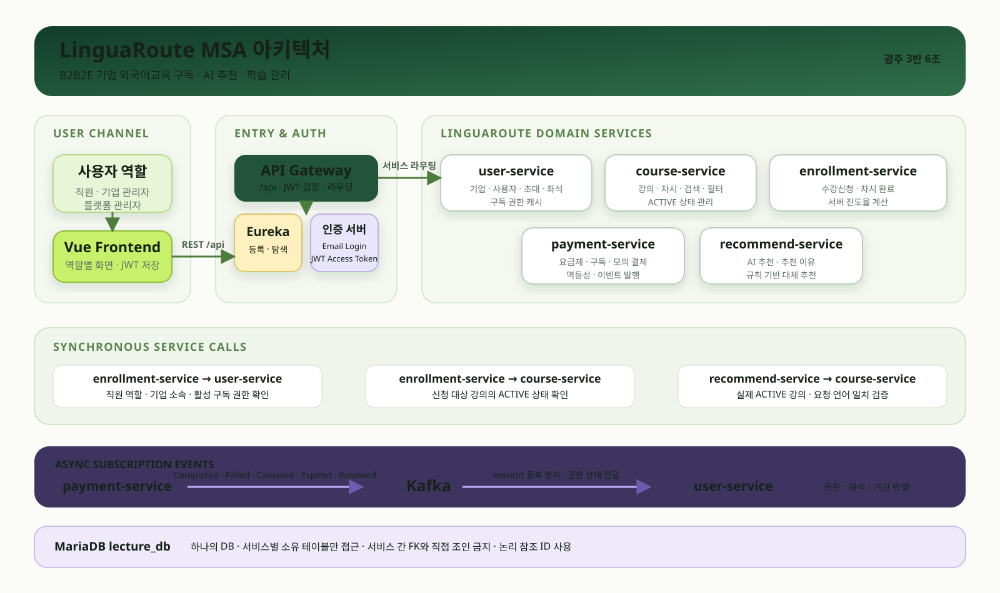

### 과제 제공 구조를 LinguaRoute 도메인으로 치환

| 제공 구조 | LinguaRoute 서비스명 | 담당 책임 |
| --- | --- | --- |
| Auth Server | LinguaRoute 인증 서버 | 이메일·비밀번호 검증, JWT Access Token 발급 |
| API Gateway | LinguaRoute API Gateway | 외부 `/api` 요청 단일 진입점, 인증과 서비스 라우팅 |
| Eureka | LinguaRoute 서비스 레지스트리 | 서비스 인스턴스 등록, 하트비트와 탐색 |
| `user-service` | 기업·회원·직원 서비스 | 기업, 사용자, 이메일 인증, 약관, 초대, 좌석, 최신 구독 권한 |
| `course-service` | 강의·차시 서비스 | 강의와 차시 등록, 검색, 필터, `ACTIVE` 상태 관리 |
| `enrollment-service` | 수강·학습 서비스 | 수강신청, 차시 시작·완료, 서버 진도율 계산 |
| `payment-service` | 구독·결제 서비스 | 요금제, 구독, 모의 결제, 멱등성, 이벤트 발행 |
| `recommend-service` | AI 추천 서비스 | 추천 조건 분석, 추천 이유, 실제 강의 검증, 대체 추천 |
| Kafka | 구독·결제 이벤트 버스 | 결제와 구독 상태를 비동기로 전달 |
| MariaDB | `lecture_db` | 하나의 DB 안에서 서비스별 소유 테이블 분리 |

### 동기 호출 흐름

1. Vue 프론트엔드는 모든 외부 요청을 API Gateway로 보냅니다.
2. API Gateway는 Eureka에서 서비스 위치를 찾고 대상 서비스로 요청을 전달합니다.
3. 보호 API는 Access Token뿐 아니라 `user-service`의 최신 역할, 기업 소속과 상태를 확인합니다.
4. `enrollment-service`는 수강신청 전에 `user-service`의 구독 권한과 `course-service`의 `ACTIVE` 강의를 확인합니다.
5. `recommend-service`는 추천 결과를 반환하기 전에 `course-service`에서 실제 강의와 요청 언어 일치 여부를 검증합니다.

### Kafka 비동기 이벤트 흐름

| 이벤트 | 발행 조건 | `user-service` 처리 |
| --- | --- | --- |
| `PaymentCompleted` | 최초 결제 성공 | 이용 권한 활성화, 좌석과 기간 반영 |
| `PaymentFailed` | 최초 또는 갱신 결제 실패 | 초기 권한 미부여, 기존 권한은 현재 기간까지 유지 |
| `SubscriptionCanceled` | 구독 해지 요청 | 자동 갱신 중지, 현재 기간까지 권한 유지 |
| `SubscriptionExpired` | 이용 기간 종료 | 권한 만료, 신규 직원 가입과 수강신청 차단 |
| `SubscriptionRenewed` | 갱신 결제 성공 | 새 이용 기간과 좌석 한도 반영 |

각 이벤트는 고유 `eventId`를 가지며 소비자는 같은 이벤트를 여러 번 받아도 한 번만 처리합니다.

### 데이터 소유권 원칙

- MariaDB 한 개와 `lecture_db` 한 개를 유지합니다.
- 각 서비스는 자신의 테이블만 접근합니다.
- 다른 서비스의 `companyId`, `userId`, `courseId`, `lessonId`는 논리 참조로 저장합니다.
- 서비스 사이 직접 DB 조인이나 서비스 간 외래키를 만들지 않습니다.
- 데이터 조회는 REST API, 상태 전달은 Kafka 이벤트를 사용합니다.

## 5. 프론트엔드 API 명세

모든 보호 API는 `Authorization: Bearer {accessToken}`을 사용합니다. 로그인과 모든 외부 요청은 API Gateway의 `/api` 경로를 사용합니다. OAuth2 Authorization Code 흐름과 Refresh Token은 사용하지 않습니다.

### 핵심 엔드포인트 목록

| 화면·기능 | Method | URL | 권한 | Request 핵심 | Response 핵심 |
| --- | --- | --- | --- | --- | --- |
| 로그인 | `POST` | `/api/auth/login` | 공개 | 이메일·비밀번호 | JWT Access Token과 만료시간 |
| 기업 가입 | `POST` | `/api/companies` | 공개 | 기업·관리자·인증·약관 | 기업·사용자 ID와 역할 |
| 직원 가입 | `POST` | `/api/employees/signup` | 공개 | 초대코드·직원·인증·약관 | 직원 계정과 좌석 배정 |
| 내 정보 | `GET`, `PATCH` | `/api/users/me` | 로그인 | 수정할 사용자 정보 | 사용자·역할·기업 정보 |
| 기업 정보 | `GET`, `PATCH` | `/api/companies/me` | 기업 관리자 | 수정할 기업 정보 | 자신의 기업 정보 |
| 요금제 | `GET` | `/api/plans` | 기업 관리자 | 없음 | 가격·주기·좌석 수 |
| 구독 결제 | `POST` | `/api/subscriptions` | 기업 관리자 | 요금제·결제 토큰·멱등성 키 | 구독·결제 ID와 기간 |
| 구독 조회 | `GET` | `/api/subscriptions/me` | 기업 관리자 | 없음 | 상태·만료일·자동 갱신 |
| 구독 해지 | `POST` | `/api/subscriptions/me/cancel` | 기업 관리자 | 해지 사유 | 현재 기간 종료 후 해지 정보 |
| 결제 내역 | `GET` | `/api/payments` | 기업 관리자 | 없음 | 금액·일시·결제 상태 |
| 초대 생성·조회 | `POST`, `GET` | `/api/companies/me/invitations` | 기업 관리자 | 만료 일수 | 코드·상태·만료일 |
| 초대 폐기 | `DELETE` | `/api/companies/me/invitations/{id}` | 기업 관리자 | 초대 ID | 본문 없는 성공 응답 |
| 초대 재발급 | `POST` | `/api/companies/me/invitations/{id}/reissue` | 기업 관리자 | 초대 ID | 새 일회용 코드 |
| 직원 목록 | `GET` | `/api/companies/me/employees` | 기업 관리자 | 검색·상태 조건 | 소속 직원과 계정 상태 |
| 좌석 현황 | `GET` | `/api/companies/me/seats` | 기업 관리자 | 없음 | 구매·사용·잔여 좌석 |
| 기업 진도 | `GET` | `/api/companies/me/enrollments/progress` | 기업 관리자 | 직원·상태 조건 | 직원별 강의와 진도율 |
| 강의 검색 | `GET` | `/api/courses` | 직원 | 검색어·언어·상황·수준 | `ACTIVE` 강의 페이지 |
| 강의 상세 | `GET` | `/api/courses/{courseId}` | 직원 | 강의 ID | 강의 상세 정보 |
| 차시 목록 | `GET` | `/api/courses/{courseId}/lessons` | 직원 | 강의 ID | 정렬된 차시 목록 |
| 수강신청 | `POST` | `/api/enrollments` | 직원 | 강의 ID | 수강 ID·상태·진도율 |
| 내 학습 | `GET` | `/api/enrollments/me` | 직원 | 상태 조건 | 신청 강의와 학습 상태 |
| 차시 시작 | `POST` | `/api/enrollments/{enrollmentId}/lessons/{lessonId}/start` | 직원 | 수강·차시 ID | 학습 시작 시각과 상태 |
| 차시 완료 | `POST` | `/api/enrollments/{enrollmentId}/lessons/{lessonId}/complete` | 직원 | 수강·차시 ID | 서버 계산 진도율 |
| AI 추천 | `POST` | `/api/courses/recommendations` | 직원 | 언어·수준·직무·상황·목표 | 추천 강의·이유·생성 방식 |
| 강의 등록 | `POST` | `/api/admin/courses` | 플랫폼 관리자 | 강의 정보 | 생성 강의 |
| 강의 수정 | `PATCH` | `/api/admin/courses/{courseId}` | 플랫폼 관리자 | 변경 정보 | 수정 강의 |
| 운영 조회 | `GET` | `/api/admin/users`, `/companies`, `/payments`, `/enrollments` | 플랫폼 관리자 | 검색·상태 조건 | 영역별 운영 목록 |

### 예시 1. 이메일·비밀번호 로그인

```http
POST /api/auth/login
Content-Type: application/json
```

```json
{
  "email": "employee@company.com",
  "password": "Password123!"
}
```

```json
{
  "data": {
    "accessToken": "jwt-access-token",
    "tokenType": "Bearer",
    "expiresIn": 3600
  }
}
```

프론트엔드는 반환된 JWT Access Token을 보호 API의 `Authorization: Bearer` 헤더에 사용합니다. 토큰이 만료되면 다시 로그인합니다.

### 예시 2. 구독 결제

```http
POST /api/subscriptions
Authorization: Bearer {accessToken}
Idempotency-Key: 1e7f52d5-c0d5-4a86-aefe-3334f664ee65
Content-Type: application/json
```

```json
{
  "planPriceId": 1,
  "paymentMethodToken": "mock-success"
}
```

```json
{
  "data": {
    "subscriptionId": 7001,
    "paymentId": 8001,
    "status": "ACTIVE",
    "currentPeriodStart": "2026-08-10T10:30:00+09:00",
    "currentPeriodEnd": "2026-09-10T10:30:00+09:00",
    "nextBillingAt": "2026-09-10T10:30:00+09:00"
  }
}
```

동일한 `Idempotency-Key`로 다시 요청하면 새 결제를 만들지 않고 기존 결과를 반환합니다.

### 예시 3. 직원 초대코드 생성

```http
POST /api/companies/me/invitations
Authorization: Bearer {accessToken}
Content-Type: application/json
```

```json
{
  "expiresInDays": 7
}
```

```json
{
  "data": {
    "invitationId": 501,
    "code": "A7K9-P2QM",
    "status": "UNUSED",
    "expiresAt": "2026-08-17T23:59:59+09:00"
  }
}
```

### 예시 4. 수강신청

```http
POST /api/enrollments
Authorization: Bearer {accessToken}
Content-Type: application/json
```

```json
{
  "courseId": 12
}
```

```json
{
  "data": {
    "enrollmentId": 9001,
    "courseId": 12,
    "status": "ENROLLED",
    "progressRate": 0
  }
}
```

서버는 직원 역할, 기업의 활성 구독, 강의의 `ACTIVE` 상태와 중복 신청 여부를 모두 확인합니다.

### 예시 5. AI 강의 추천

```http
POST /api/courses/recommendations
Authorization: Bearer {accessToken}
Content-Type: application/json
```

```json
{
  "language": "ENGLISH",
  "level": "INTERMEDIATE",
  "job": "GLOBAL_SALES",
  "situation": "CUSTOMER_MEETING",
  "goal": "제품을 자연스럽게 설명하고 싶음"
}
```

```json
{
  "data": {
    "recommendationId": 3001,
    "source": "AI",
    "courses": [
      {
        "courseId": 12,
        "title": "해외 고객 미팅 영어",
        "language": "ENGLISH",
        "level": "INTERMEDIATE",
        "reason": "해외영업 직무와 고객 미팅 목표에 적합합니다."
      }
    ]
  }
}
```

### 주요 오류 응답

| HTTP | 오류 코드 | 상황 |
| --- | --- | --- |
| 401 | `INVALID_CREDENTIALS` | 로그인 정보 불일치 |
| 403 | `USER_INACTIVE` | 비활성 또는 탈퇴 사용자 |
| 409 | `DUPLICATE_PAYMENT` | 중복 결제 요청 |
| 409 | `INVITATION_ALREADY_USED` | 이미 사용한 초대코드 |
| 409 | `SEAT_LIMIT_EXCEEDED` | 잔여 좌석 없음 |
| 409 | `DUPLICATE_ENROLLMENT` | 같은 강의 중복 신청 |
| 422 | `SUBSCRIPTION_INACTIVE` | 활성 구독 없음 |
| 422 | `COURSE_INACTIVE` | 비활성 강의 신청 |
| 503 | `AI_RECOMMENDATION_FAILED` | AI와 대체 추천 모두 실패 |

### Swagger 실행 검증

2026-08-11 Java 21로 로컬 실행한 `course-service` Swagger에서 `GET /api/courses/internal/recommend?language=ENGLISH`를 직접 실행하여 `200 OK`와 JSON 응답을 확인했습니다.

보호 API인 `GET /api/courses`는 인증 토큰 없이 직접 호출하면 `401 Unauthorized`가 반환됩니다. 따라서 Swagger 캡처는 course-service의 실제 기동과 공개 내부 추천 API 응답 확인 증거이며, 전체 API Gateway 인증 흐름 완료로 표시하지 않습니다.

발표 전에는 최신 백엔드를 재빌드한 뒤 각 Swagger에서 목표 API를 실행하고 프론트를 `VITE_USE_LIVE_API=true`로 연결하여 최종 요청·응답을 다시 캡처해야 합니다.

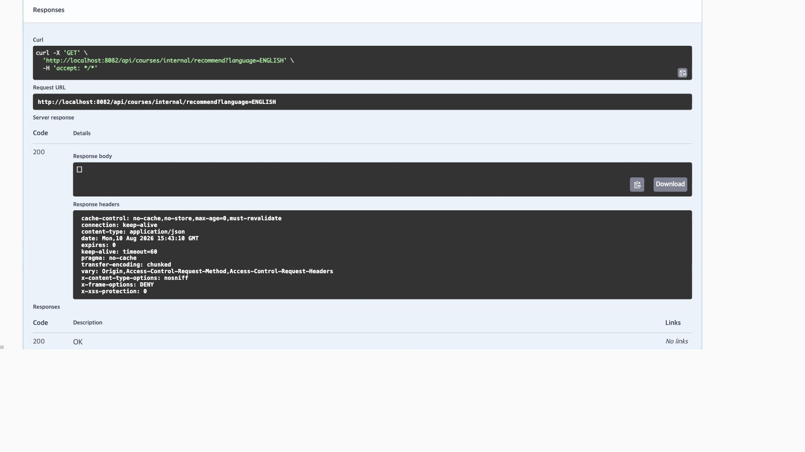

## 6. 동작 화면 스냅샷

아래 화면은 최신 프론트 퍼블리싱을 `VITE_USE_LIVE_API=false`로 실행하여 브라우저에서 버튼과 상태 변화를 직접 조작한 UI 프로토타입입니다. 실제 실행이 확인된 API 증거는 위 Swagger 캡처입니다. UI 상태 변화와 전체 API 통합 완료를 구분하여 발표합니다.

### 화면 1. B2B2E 서비스 소개

기업 관리자, 직원, 플랫폼 관리자의 세 관점을 하나의 서비스로 연결한다는 핵심 가치를 보여줍니다.

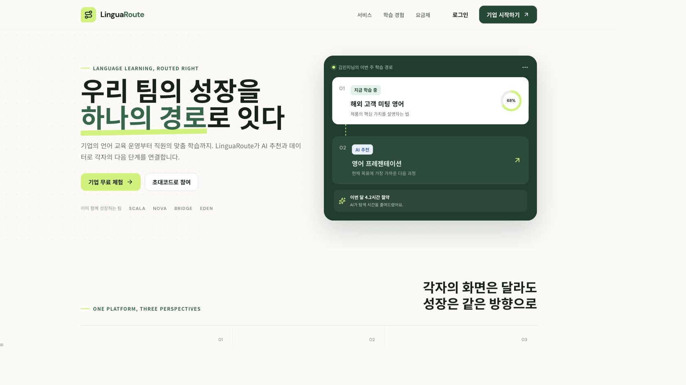

### 화면 2. 기업 구독 결제 전과 결제 후

`POST /api/subscriptions` 목표 요청의 전후 상태입니다. 결제 전에는 요금제·주기·좌석을 확인하고, 결제 후에는 `PaymentCompleted → 구독 ACTIVE → 좌석 50석` 변화를 보여줍니다.

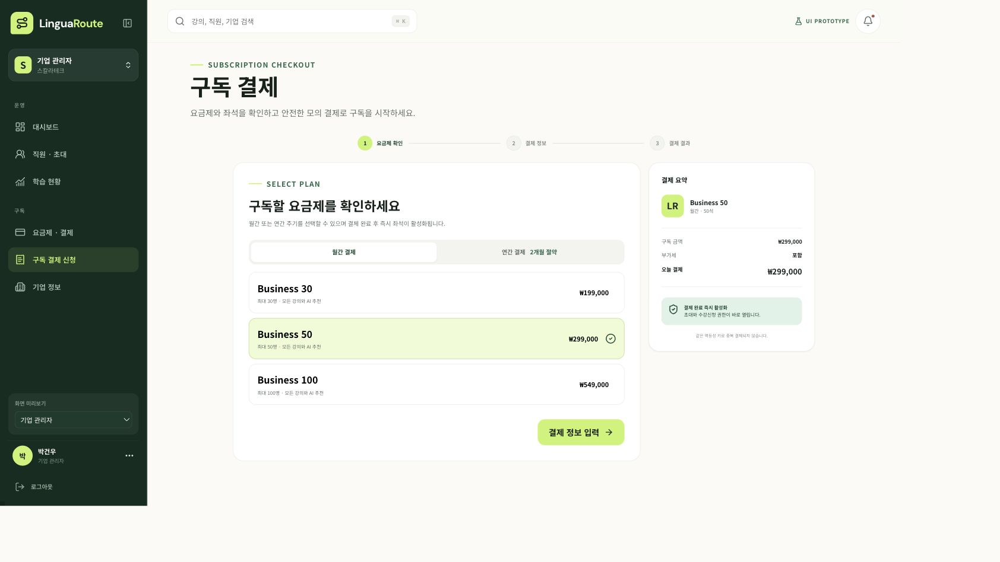

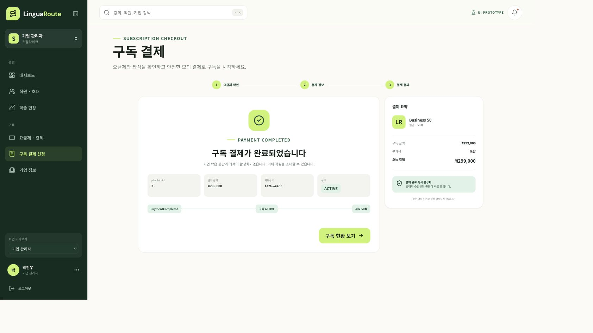

### 화면 3. 직원 현황과 초대코드 생성

직원·좌석 현황을 확인한 뒤 일회용 초대코드를 생성하는 기업 관리자 흐름입니다.

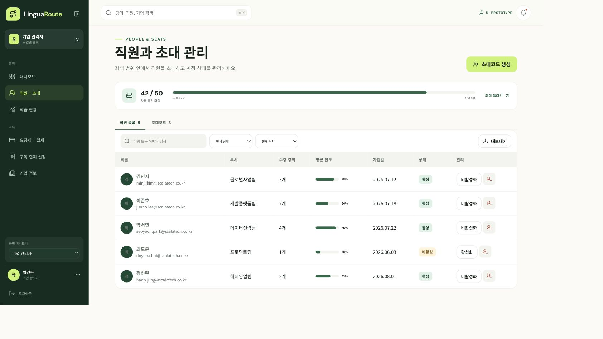

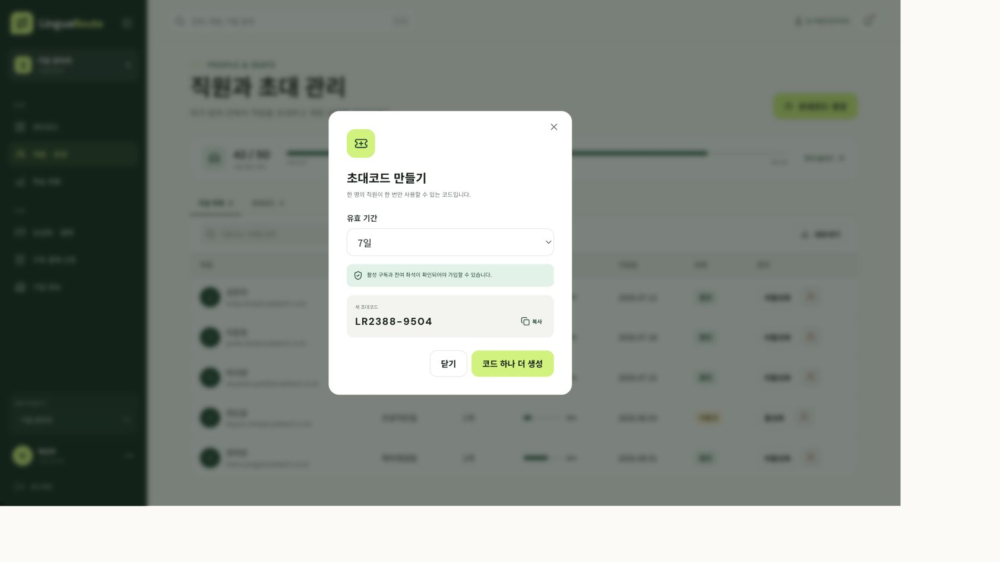

### 화면 4. 강의 상세와 수강신청 완료

직원이 기업 구독 권한과 강의 상태를 확인하고 수강신청 성공 응답을 받았을 때 버튼과 안내 문구가 바뀌는 장면입니다.

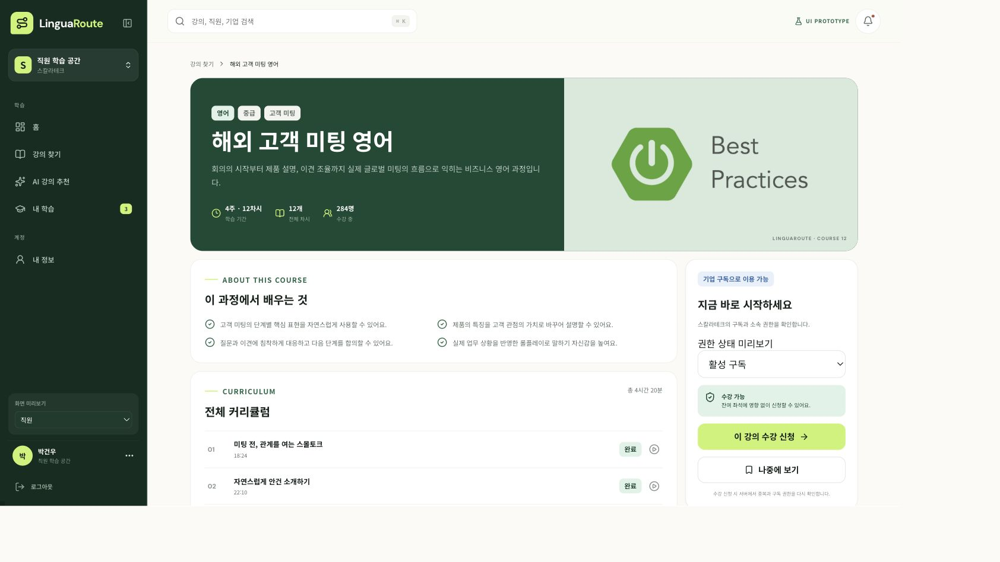

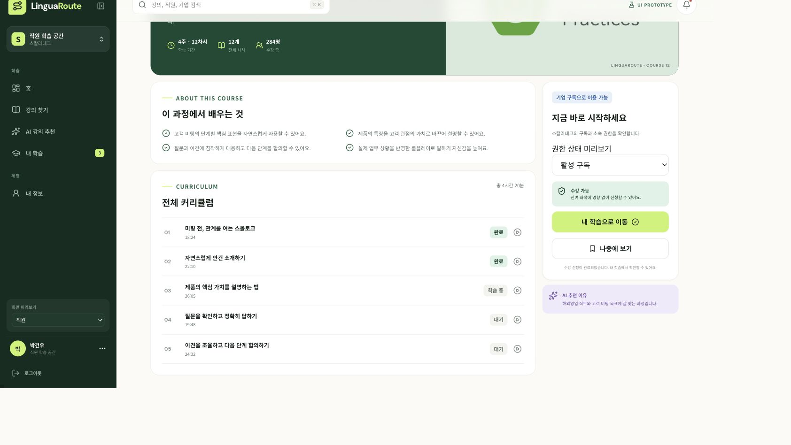

### 화면 5. AI 추천 결과

직원이 영어·중급·글로벌 세일즈·고객 미팅과 목표를 입력한 뒤 추천 강의와 추천 이유를 확인하는 장면입니다.

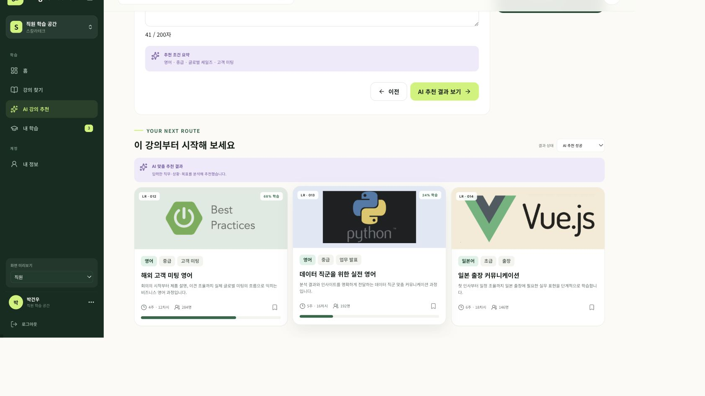

### 화면 6. 기업 관리자 학습 성과

직원·부서별 진도율과 수료 현황을 확인하는 기업 관리자 화면입니다.

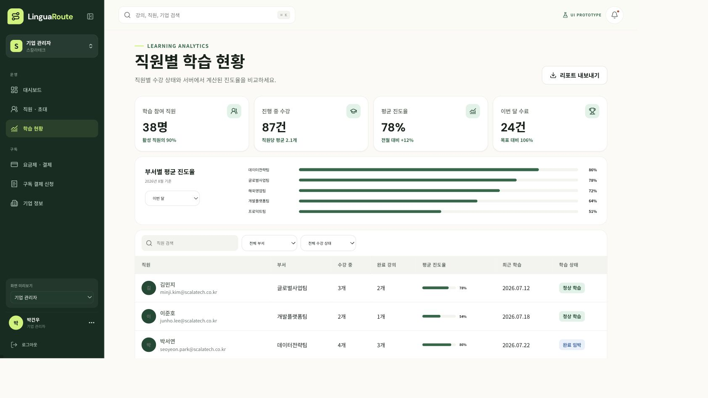

### 화면 7. 플랫폼 관리자 운영

기업, 사용자, 결제, 수강과 예외 알림을 통합 조회하는 플랫폼 관리자 화면입니다.

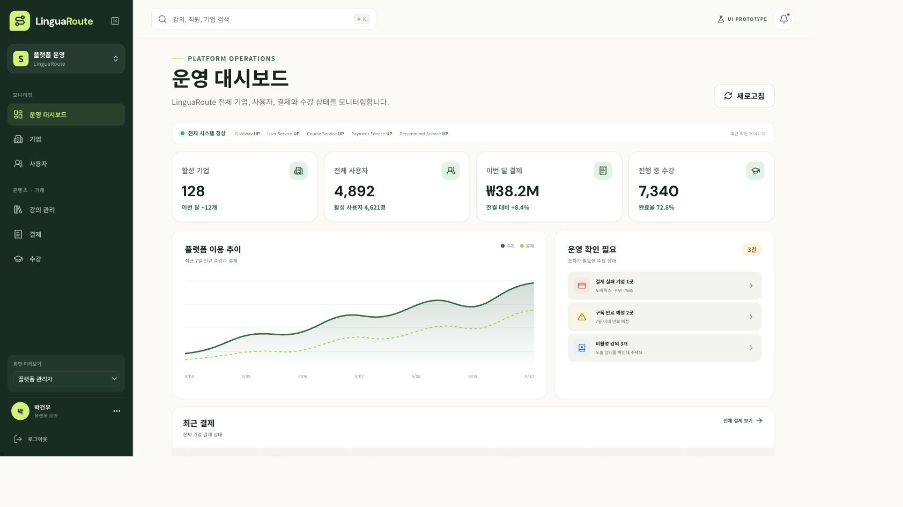

## 발표 시연 시나리오

```text
기업 관리자: 요금제 선택 → 모의 결제 → 구독 ACTIVE·좌석 활성화
→ 기업 관리자: 초대코드 생성
→ 직원: 초대 가입 → AI 추천 조건 입력 → 추천 강의 확인
→ 직원: 강의 상세 → 수강신청 → 차시 완료 → 진도율 증가
→ 기업 관리자: 직원별 진도 확인
→ 플랫폼 관리자: 기업·결제·수강 운영 상태 확인
```

발표에서는 요청 URL, HTTP 상태 코드, 응답 데이터와 화면 상태 변화를 같은 순서로 설명합니다.

## 팀 담당 영역

| 팀원 | 담당 영역 | 담당 서비스 | 핵심 책임 |
| --- | --- | --- | --- |
| 임해안 | 기업·회원·직원 관리 | `user-service` | 기업계정, 직원계정, 초대코드, 좌석 |
| 박건우 | 구독·결제·프론트엔드 | `payment-service`, Kafka, Vue | 요금제, 구독, 결제, 이벤트, 프론트엔드 |
| 김주오 | 강의·차시 관리 | `course-service` | 강의 CRUD, 검색, 필터, 차시 |
| 성가연 | 수강·학습 관리 | `enrollment-service` | 수강신청, 진도율, 완료 처리 |
| 김지민 | AI 추천·통합 | `recommend-service` | AI 추천, Gateway 연동, 통합 테스트 |
