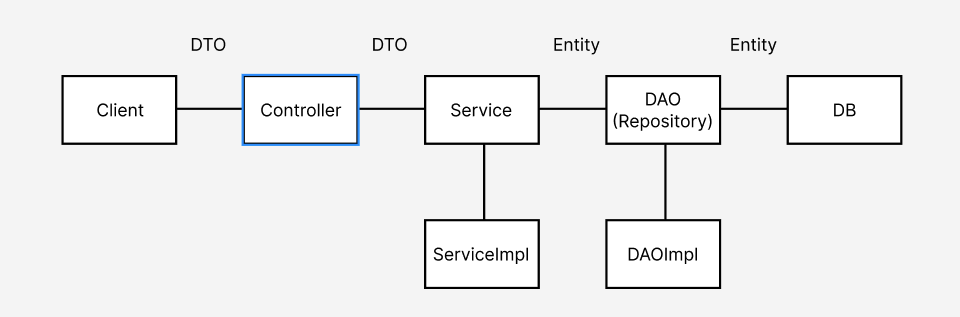
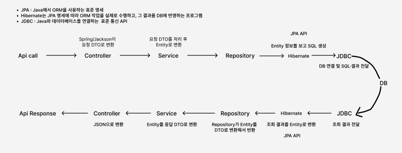

# Agile 방법론 및 MSA 개발 개인과제

## MSA를 처음 접한 상태에서 LinguaRoute를 끝까지 연결해 본 과정

| 항목 | 내용 |
| --- | --- |
| 반 | 광주 3반 |
| 조 | 6조 |
| 이름 | 박건우 |
| 프로젝트 | LinguaRoute |
| 작성일 | 2026년 8월 11일 |

---

## Chapter 1. 과제를 시작하기 전 내가 알고 있던 것

### 1. 스프링 부트에 대한 나의 출발점

이번 수업 전까지 내가 이해하고 있던 백엔드의 범위는 하나의 스프링 부트 애플리케이션 안에서 요청이 처리되는 과정까지였다. 클라이언트가 API를 호출하면 Controller가 요청을 받고, Service가 검증과 계산 같은 비즈니스 로직을 처리하고, Repository가 Entity를 DB에 저장하거나 조회한다고 이해하고 있었다.

```text
Client
  → Controller
  → Service
  → Repository
  → Database
```



*그림 1. 수업 전 내가 이해하고 있던 Controller-Service-Repository 중심의 Spring 계층 구조*

Controller와 Service 사이에서는 요청·응답 DTO를 사용하고, Service와 Repository 사이에서는 Entity를 사용한다는 것도 알고 있었다. `@RestController`, `@Service`, `@Transactional`, `@Repository`, `@Entity` 같은 어노테이션이 각각 어떤 계층을 나타내는지도 학습했다. 내 머릿속의 백엔드는 여기까지였다. 역할을 나누는 이유는 알았지만, 그 역할들은 결국 하나의 서버와 하나의 실행 파일 안에 있다고 생각했다.



*그림 2. Controller에서 시작한 요청이 JPA·Hibernate·JDBC를 거쳐 DB에 전달되고 JSON 응답으로 돌아오는 흐름*

두 번째 그림처럼 Spring이 JSON을 DTO로 변환하고, Service가 DTO와 Entity를 구분해 처리하며, Repository 아래에서 JPA·Hibernate·JDBC가 DB와 연결된다고 이해하고 있었다. 다만 이 흐름이 여러 서버에 걸쳐 이어지는 모습은 아직 경험해 보지 못했다.

MSA는 말로만 들어 보았다. 처음에는 하나의 큰 서버를 여러 서버로 나누면 부하를 분산할 수 있고 유지보수가 쉬워지는 구조 정도로 이해했다. 틀린 설명은 아니지만, 직접 프로젝트를 해 보니 이것만으로는 MSA를 설명하기 부족했다.

### 2. 직접 해 보고 바뀐 MSA에 대한 이해

지금 내가 이해한 MSA의 핵심은 단순히 서버 수를 늘리는 것이 아니라 **업무 책임과 변경 단위를 나누는 것**이다. 모놀리식 애플리케이션은 회원, 강의, 수강, 결제가 하나의 배포 단위에 들어갈 수 있다. 반면 MSA는 서로 다른 이유로 변경되는 도메인을 독립된 서비스로 분리하고, 각 서비스가 자신의 로직과 데이터를 책임지도록 만든다.

이렇게 나누면 결제 기능만 수정해 다시 배포하거나, 사용량이 많은 서비스만 별도로 확장할 수 있다. 한 서비스의 코드 변경이 항상 전체 애플리케이션 재배포로 이어지지 않는다는 장점도 있다. 다만 서비스가 나뉘는 순간 네트워크 통신, 인증, 데이터 정합성, 장애 추적이라는 새로운 문제가 생긴다. 따라서 MSA는 모든 시스템에 무조건 적용하면 좋은 정답이 아니라는 점도 알게 되었다.

수업 자료에서 MSA를 DT 플랫폼 관점의 Speed, Safety, Scale과 연결한 부분이 기억에 남았다. 변경을 더 빨리 반영해야 하는가, 한 서비스의 장애가 전체 장애로 번지는 것을 줄여야 하는가, 특정 기능만 독립적으로 확장해야 하는가와 같은 비즈니스 요구가 먼저 있어야 한다. 규모가 작고 변경도 거의 없는 서비스라면 여러 서버와 운영 도구를 관리하는 비용이 더 클 수 있다. 내가 내린 결론은 **MSA 자체가 목적이 아니라, 빠른 변화와 독립적인 운영이 필요한 서비스를 만들기 위한 선택지**라는 것이다.

### 3. 기존 계층 구조와 MSA는 서로 다른 이야기가 아니었다

처음에는 MSA를 배우면 기존의 Controller, Service, Repository 구조와 전혀 다른 방식을 다시 배워야 한다고 생각했다. 실제 코드를 보니 각 마이크로서비스 안에는 내가 알던 계층 구조가 그대로 있었다.

```text
Vue Frontend
  → API Gateway
  → payment-service의 Controller
  → payment-service의 Service
  → payment-service의 Repository
  → payment-service가 소유한 테이블
```

차이는 한 Service가 다른 도메인의 Repository를 직접 사용하는 대신, 다른 서비스의 API를 호출하거나 Kafka 이벤트를 발행한다는 점이었다. 예를 들어 `enrollment-service`가 기업 권한을 확인하기 위해 `user-service`의 테이블을 직접 조회하면 서비스 경계가 무너진다. 필요한 정보는 내부 REST API로 확인하고, 결제 완료처럼 다른 서비스에 상태 변화를 알려야 하는 일은 Kafka 이벤트로 전달해야 한다.

즉, 내가 알던 계층 구조는 한 서비스 내부의 관심사 분리이고, MSA는 여러 서비스 사이의 책임과 통신 경계를 설계하는 더 큰 범위의 관심사 분리라고 이해하게 되었다.

### 4. API Gateway만 사용했던 경험에서 Eureka까지

이전에도 AWS API Gateway를 사용해 본 경험은 있었다. 당시에는 API Gateway로 들어온 요청을 하나의 Lambda가 받은 뒤, Lambda 내부에서 경로와 요청 값에 따라 실행할 로직을 나누는 방식이었다. 그래서 API Gateway를 여러 API 요청을 한곳에서 받아 주는 입구 정도로 이해하고 있었다.

이번 프로젝트에서는 Gateway 뒤에 여러 개의 독립된 서비스가 있었고, Eureka가 실행 중인 서비스의 이름과 위치를 등록·조회했다. Gateway나 다른 서비스는 특정 IP와 포트를 코드에 고정하는 대신 Eureka에 등록된 서비스 이름을 기준으로 대상을 찾을 수 있었다.

```text
이전에 경험한 방식
Client → API Gateway → 하나의 Lambda → Lambda 내부에서 요청 분기

이번 프로젝트
Client → API Gateway → Eureka에서 서비스 위치 확인 → 각 도메인 서비스
```

처음에는 서비스 주소를 환경변수에 적으면 되는데 Eureka가 왜 필요한지 바로 이해되지 않았다. 직접 여러 컨테이너를 실행해 보니 서비스의 IP나 실행 위치는 바뀔 수 있고, 같은 서비스를 여러 개 실행할 수도 있다는 점을 알게 되었다. Eureka는 단순히 요청을 대신 전달하는 서버가 아니라, 현재 사용할 수 있는 서비스의 위치를 알려 주는 Service Discovery 역할이었다. 기존 API Gateway 경험과 비교하니 Gateway의 라우팅과 Eureka의 서비스 탐색이 서로 다른 책임이라는 점도 명확해졌다.

이 과정은 Spring을 공부하며 배운 OOP를 다시 이해하는 계기도 되었다. OOP를 처음 배울 때는 클래스를 나누고 상속이나 인터페이스를 사용하는 문법에 더 집중했다. 이번에는 `SubscriptionController`가 HTTP 요청만 받고, `SubscriptionService`가 구독 규칙을 처리하며, Repository와 Kafka Producer가 각각 저장과 이벤트 전달을 맡는 구조를 직접 만들었다. 한 객체가 모든 일을 하지 않도록 책임을 나누는 SRP와, 구체적인 구현보다 인터페이스와 주입된 의존성에 기대는 DIP가 실제 유지보수와 테스트를 위한 원칙이라는 점이 더 와닿았다.

더 크게 보면 각 마이크로서비스도 하나의 객체처럼 자신의 상태와 책임을 가지고, 외부에 공개한 API와 이벤트를 통해서만 협력한다고 느꼈다. 객체가 다른 객체의 내부 필드를 직접 건드리지 않는 것처럼, 한 서비스가 다른 서비스의 테이블을 직접 조회하지 않는다는 규칙도 같은 방향으로 이해할 수 있었다. 물론 OOP와 MSA가 같은 개념은 아니지만, **내부 구현을 숨기고 명확한 책임과 계약으로 협력한다는 생각이 클래스 수준에서 서비스 수준으로 확장된 것**처럼 느껴졌다.

---

## Chapter 2. LinguaRoute 조별과제와 나의 작업

### 1. 우리가 만든 서비스

LinguaRoute는 기업이 월간 또는 연간 구독권을 구매하고, 초대받은 직원이 외국어 강의를 수강하는 B2B2E 외국어교육 서비스이다. 직원은 언어, 수준, 직무, 상황과 목표를 입력해 AI 강의 추천도 받을 수 있다.

```text
플랫폼 운영
  → 기업 구독·결제
  → 좌석에 맞춘 직원 초대
  → 직원 강의 탐색·수강
  → 학습 진도와 AI 추천
```

기존 교육용 프로젝트는 사용자, 강의, 수강, 결제, 추천 서비스로 나뉘어 있었다. 우리 조는 이 구조를 버리고 새로 만드는 대신 서비스 경계를 LinguaRoute의 도메인에 맞게 확장했다.

- `user-service`: 기업, 사용자, 역할, 직원 초대, 좌석과 이용 권한
- `course-service`: 외국어 강의와 차시, 검색과 활성 상태
- `enrollment-service`: 수강신청, 차시 학습과 진도율
- `payment-service`: 요금제, 구독, 결제와 구독 이벤트
- `recommend-service`: 조건 기반 추천, 추천 결과 검증과 저장
- Auth Server, API Gateway, Eureka: 인증, 단일 진입점, 서비스 탐색

MariaDB 인스턴스는 하나를 사용했지만 각 서비스가 자신의 테이블만 소유하도록 정했다. 다른 서비스의 ID는 논리적인 참조로만 저장하고 서비스 사이의 직접 조인은 하지 않는 방향으로 설계했다.

### 2. Agile을 적용한 진행 방식

짧은 시간 안에 모든 화면과 모든 API를 동시에 완성하려고 하면, 마지막에야 서로 맞지 않는 부분을 발견할 가능성이 컸다. 그래서 팀에서는 먼저 사용자가 처음부터 끝까지 경험할 수 있는 작은 흐름을 만들고, 그다음 서비스 범위를 넓히는 방식으로 진행했다.

Sprint 1의 목표는 직원 학습의 Walking Skeleton을 만드는 것이었다.

```text
로그인 → 강의 검색·필터 → 강의 상세 → 수강신청 → 내 학습 확인
```

Sprint 2에서는 기업 운영과 시스템 처리를 확장했다.

```text
구독·결제 → Kafka 구독 이벤트 → 좌석 권한 갱신
직원 초대 → 학습 진도 → 플랫폼 운영 → AI 추천
```

이번 과제에서 Agile은 단순히 작업 기간을 둘로 나누는 말이 아니었다. Sprint 1에서 실제로 이어지는 사용자 흐름을 먼저 만들었기 때문에 Sprint 2에서 어떤 API가 부족한지, 화면이 어떤 값을 필요로 하는지 더 빨리 알 수 있었다. 또한 MVP 체크리스트와 API 명세를 공통 기준으로 두어 각자 맡은 서비스가 서로 다른 방향으로 가는 것을 줄였다.

개발을 시작하기 전에도 우리 나름대로 서비스 주제와 사용자 흐름을 최대한 구체화했다고 생각했다. 하지만 실제 프로젝트 기간이 매우 짧다 보니, 충분히 자세하게 정리했다고 생각한 기획도 개발을 시작하면 비어 있는 조건과 서로 어긋나는 부분이 바로 드러났다. 화면에 필요한 응답 필드, 역할별 권한, 상태가 바뀌는 시점과 예외 상황까지 미리 정리하지 못한 부분이 있었고, 그때마다 개발 중간에 다시 합의해야 했다.

Agile에서는 일단 빠르게 치고 나가는 것도 중요하지만, 무엇을 만들 것인지에 대한 최소한의 기준이 없으면 오히려 같은 기능을 다시 만들게 된다는 것을 몸소 느꼈다. 짧은 기간일수록 기획을 길게 하는 것이 아니라, 사용자 흐름·핵심 API·완료 조건을 먼저 명확하게 정하고 개발 중 발견한 내용은 바로 백로그와 문서에 반영해야 한다는 점을 배웠다. 이번 경험을 통해 기획은 개발 전에 끝내는 문서가 아니라 Sprint가 진행되는 동안 계속 다듬어야 하는 작업이라는 생각으로 바뀌었다.

### 3. 내가 맡은 역할

팀의 공식 담당 영역에서 나는 `payment-service`의 구독·결제와 Vue 프론트엔드를 맡았다. 커밋 기록을 다시 확인해 보니 내가 한 작업은 크게 다음 네 가지로 정리할 수 있었다.

첫째, Vue 3와 Vite로 플랫폼 관리자, 기업 관리자, 직원 역할별 화면을 구성했다. 랜딩, 로그인, 요금제, 구독·결제, 직원 관리, 강의, 수강, AI 추천과 운영 화면이 하나의 서비스처럼 보이도록 공통 레이아웃과 라우팅을 정리했다.

둘째, 초기 화면을 실제 API와 연결했다. 첫 화면 구현에서는 전체 사용자 흐름과 화면 구조를 빨리 확인하기 위해 일부 mock 데이터를 사용했다. 이후 커밋에서는 `axios` 공통 인스턴스가 Access Token을 넣어 Gateway만 호출하도록 바꾸고, 기업 대시보드·구독·결제·강의·수강 데이터를 실제 응답으로 교체했다.

셋째, `payment-service`에 요금제, 요금제 가격, 구독, 결제, 멱등키와 Outbox 이벤트 처리를 구현했다. 결제 완료, 결제 실패, 구독 해지, 만료, 갱신의 다섯 이벤트를 정의하고 테스트를 보강했다.

넷째, 통합 과정에서 발견된 경계 문제를 함께 수정했다. 기존 Auth Server 이미지가 기대하는 사용자 스키마와 현재 `user-service` 스키마의 차이를 마이그레이션으로 맞추고, ARM64 환경에서도 팀원이 같은 이미지를 실행할 수 있도록 오프라인 Compose 구성을 정리했다. 발표자료와 시연 문서도 최종 구현 상태와 맞게 갱신했다.

### 4. 프론트엔드를 만들며 배운 점

프론트엔드는 이전에도 경험해 본 영역이라 화면과 기능이 다르다는 점 자체는 알고 있었다. 이번에는 그 차이를 MSA 통합 과정에서 더 구체적으로 확인했다. 처음에는 mock 데이터를 사용해 역할별 화면과 전체 사용자 흐름을 빠르게 맞춘 뒤, 실제 API를 연결하면서 **화면이 존재하는 것과 각 서비스의 권한·상태·응답까지 맞아 사용자 기능이 완료되는 것은 다르다**는 점을 다시 확인했다.

예를 들어 구독 화면에는 현재 요금제, 이용 기간, 좌석 사용량, 결제 이력이 함께 표시된다. 화면 하나이지만 데이터는 `payment-service`와 `user-service`에 나뉘어 있다. 프론트는 다음과 같이 여러 API 결과를 조합해야 했다.

```text
GET /api/subscriptions/me  → 현재 구독과 이용 기간
GET /api/payments          → 결제 내역
GET /api/companies/me/seats → 구매·사용·잔여 좌석
GET /api/plans             → 변경 가능한 요금제
```

이때 브라우저가 서비스 포트들을 각각 알고 있으면 환경마다 주소와 인증 처리가 복잡해진다. 우리 프론트는 API Gateway의 `/api`만 호출하고, 공통 `axios` interceptor에서 Access Token을 넣도록 했다. 이 작업을 통해 Gateway가 단순한 중계 서버가 아니라 외부 요청의 진입점과 인증 기준을 한곳으로 모으는 역할이라는 것을 이해했다.

또한 프론트에서 가격이나 좌석 수, 진도율을 임의로 계산해 서버 책임을 대신하면 안 된다는 점도 배웠다. 화면은 서버가 검증한 결과를 표현해야 한다. 특히 결제 금액과 권한처럼 조작 위험이 있는 값은 클라이언트의 표시값을 신뢰하면 안 된다.

### 5. 구독·결제 흐름으로 이해한 MSA

내가 구현한 부분 중 MSA를 가장 잘 이해하게 해 준 것은 구독 결제 흐름이었다.

```text
Vue 구독 화면
  → API Gateway
  → POST /api/subscriptions
  → SubscriptionController
  → SubscriptionService
  → Subscription·Payment·OutboxEvent 저장
  → OutboxEventPublisher가 Kafka 발행
  → user-service가 이벤트 소비
  → 기업 좌석·이용 권한 갱신
```

`SubscriptionService`에서는 먼저 `Idempotency-Key`를 확인한다. 사용자가 결제 버튼을 두 번 누르거나 네트워크 재시도로 같은 요청이 다시 들어와도 같은 기업과 멱등키의 결제를 다시 만들지 않기 위해서이다. 기존에는 중복 저장을 Repository의 단순 조회 문제로만 생각했지만, 결제처럼 외부 요청이 재전송될 수 있는 환경에서는 요청 자체를 식별하는 기준이 필요하다는 것을 배웠다.

결제가 성공하면 구독과 결제 상태를 DB에 반영하고 `PaymentCompleted` 이벤트 내용을 Outbox 테이블에 함께 저장한다. 이후 별도의 Publisher가 아직 발행되지 않은 Outbox 이벤트를 Kafka로 보낸다. DB 저장 직후 바로 Kafka만 호출할 경우, DB는 성공했는데 Kafka 발행은 실패하는 상황이 생길 수 있다. Outbox를 사용하면 발행할 이벤트 기록이 DB에 남아 있어 다시 시도할 수 있다.

이 부분에서 `@Transactional`의 범위도 다시 생각하게 되었다. 모놀리식에서는 하나의 트랜잭션으로 여러 Repository 변경을 묶으면 된다고 생각하기 쉽다. 하지만 `payment-service`의 트랜잭션이 `user-service`의 DB 변경과 Kafka까지 한 번에 롤백해 주지는 않는다. 각 서비스는 자신의 로컬 트랜잭션을 책임지고, 서비스 사이에는 이벤트 재시도와 중복 처리 같은 별도의 안전장치가 필요하다.

### 6. Kafka 이벤트를 통해 알게 된 결과적 일관성

결제가 끝난 즉시 모든 서비스의 데이터가 한 순간에 같이 바뀌는 것은 아니다. `payment-service`가 이벤트를 발행하고 `user-service`가 이를 소비한 뒤 기업의 좌석과 이용 권한이 갱신된다. 잠깐의 시간 차이는 있을 수 있지만 이벤트가 정상 처리되면 최종적으로 같은 상태에 도달한다. 이것이 이번 프로젝트에서 경험한 결과적 일관성이었다.

구독 이벤트는 다음 다섯 가지로 나누었다.

- `PaymentCompleted`: 구독 활성화와 좌석 권한 부여
- `PaymentFailed`: 결제 실패 기록
- `SubscriptionCanceled`: 자동 갱신 중지, 현재 이용 기간까지 권한 유지
- `SubscriptionExpired`: 이용 기간 종료 후 실제 권한 만료
- `SubscriptionRenewed`: 다음 이용 기간과 좌석 권한 갱신

특히 해지와 만료를 같은 상태로 처리하지 않은 점이 중요했다. 사용자가 구독을 해지해도 이미 결제한 기간까지는 학습할 수 있어야 하므로, 해지 이벤트에서는 자동 갱신만 끄고 만료 이벤트가 도착했을 때 실제 권한을 종료한다.

Kafka는 같은 메시지를 다시 전달할 수 있기 때문에 `user-service`는 `eventId`를 기준으로 이미 처리한 이벤트인지 확인한다. 같은 `PaymentCompleted`가 두 번 도착해도 좌석 권한을 두 번 적용하지 않도록 한 것이다. 이 과정을 통해 비동기 통신은 단순히 `KafkaTemplate.send()`를 호출하는 것으로 끝나는 것이 아니라, 실패와 재전송을 전제로 설계해야 한다는 것을 알게 되었다.

### 7. Docker Compose를 사용하며 느낀 운영의 차이

모놀리식 프로젝트에서는 애플리케이션 하나와 DB만 실행하면 되는 경우가 많았다. 이번 프로젝트는 Auth Server, Gateway, Eureka, 다섯 개의 도메인 서비스, MariaDB, Kafka를 함께 실행해야 했다. 서비스 하나가 실행되지 않으면 프론트 화면에서는 단순한 API 오류처럼 보이지만 실제 원인은 Gateway 라우팅, Eureka 등록, DB 마이그레이션 또는 Kafka 상태일 수 있었다.

Docker Compose는 이 많은 컨테이너의 이미지, 포트, 환경변수, 실행 순서와 health check를 하나의 실행 구성으로 관리해 주었다. 반대로 Compose 파일이 있다고 자동으로 서비스가 실행되는 것은 아니며, 이미지를 준비한 뒤 `docker compose up`을 실행해야 한다는 기본적인 차이도 직접 확인했다.

Auth Server와 API Gateway는 소스가 아니라 제공된 Docker 이미지였다는 점도 중요한 제약이었다. 처음에는 환경변수를 추가하면 Gateway의 모든 경로를 바꿀 수 있다고 생각하기 쉬웠다. 하지만 이미지 내부 코드에 공개 경로가 고정되어 있다면 Compose 환경변수만으로는 바꿀 수 없다. 수정 가능한 소스와 수정할 수 없는 인프라 이미지의 경계를 먼저 확인해야 한다는 것을 배웠다.

---

## Chapter 3. 트러블슈팅과 회고

### 1. 서로 다른 출발점에서 협업 속도를 맞추는 일

팀원들과 협업하는 과정도 생각보다 어려운 부분이 많았다. 나는 짧게 기능을 만들고 바로 다음 작업으로 넘어가는 방식으로 빠르게 치고 나가고 싶었다. 하지만 이번 과제가 첫 프로젝트인 팀원도 있었고, 전공자이지만 웹 개발과 Spring 기반 협업은 처음인 팀원도 있었다. GitHub의 브랜치, Pull Request와 충돌 해결이 처음인 팀원도 있어 같은 명령과 작업 순서를 여러 번 맞춰 보는 시간이 필요했다.

그래서 프로젝트 초반에는 내 기능부터 빠르게 만드는 것보다 팀원들이 Sprint를 시작할 수 있도록 초기 환경을 세팅하고 실행 과정을 지원하는 일을 먼저 진행했다. Docker 이미지와 Compose 실행 순서, 프론트엔드 설치, Git 브랜치 사용법과 공통 문서를 정리하고, 각자의 환경에서 막히는 부분을 함께 확인했다. 처음 해 보는 팀원이 많은 상황에서는 이런 지원이 있어야 개인의 작업뿐 아니라 팀 전체의 성장과 이후 Sprint 속도에도 도움이 된다고 생각했다.

처음에는 이 과정이 개발 속도를 늦춘다고 느끼기도 했다. 그러나 MSA 프로젝트는 한 사람이 자신의 서비스만 빨리 끝낸다고 완성되지 않았다. 팀원 한 명의 로컬에서 서비스가 실행되지 않거나 API 계약을 다르게 이해하면 통합 단계에서 더 큰 문제로 돌아왔다. 그래서 실행 명령, 브랜치 흐름, API 경로와 완료 기준을 문서로 남기고, 막힌 부분은 화면을 공유하며 하나씩 같이 확인했다.

다행히 팀원들이 새로운 기술을 배우고 맡은 기능을 완성하려는 열정이 컸다. 모르는 부분을 숨기기보다 바로 질문하고, 확인한 내용을 다시 공유하면서 생각보다 빠르게 공통 환경을 맞출 수 있었다. 서비스 주제를 정할 때도 여러 의견을 적극적으로 내고, 주어진 교육용 코드를 어떻게 B2B 외국어교육 서비스로 바꿀지 함께 구체화했다. 그 결과 초기 세팅, LinguaRoute 주제 선정, 사용자 역할과 서비스 범위 확정까지 큰 마찰 없이 빠르게 진행할 수 있었다.

나 역시 모든 기술을 알고 시작한 것은 아니었기 때문에, 누군가에게 설명하는 과정에서 내가 정확히 이해하지 못한 부분도 발견했다. 예를 들어 Compose 파일이 서비스를 정의하는 것과 실제 명령으로 컨테이너를 실행하는 것의 차이, Gateway를 거치는 외부 API와 서비스끼리 직접 호출하는 내부 API의 차이를 설명하면서 내 이해도 더 구체적으로 정리되었다.

이번 경험을 통해 협업에서 속도는 혼자 가장 빨리 가는 속도가 아니라, 팀이 같은 기준으로 다시 작업하지 않고 앞으로 갈 수 있는 속도라고 느꼈다. 초반의 지원이 있었고 팀원들이 적극적으로 따라와 준 덕분에 각자 맡은 서비스를 구현하고 마지막 통합과 발표까지 과제를 잘 마무리할 수 있었다. 다음 프로젝트에서도 시작 단계에 개발 환경과 Git 사용법을 함께 확인하는 짧은 온보딩 시간을 먼저 두고 싶다.

### 2. Docker 이미지 다운로드와 팀 실행 환경 문제

프로젝트를 처음 세팅할 때부터 모두가 같은 환경에서 시작하지 못했다. 여러 서비스를 한꺼번에 내려받고 빌드하는 과정에서 Docker의 `toomanyrequests` 오류가 발생했고, 같은 명령을 반복할수록 이미지 다운로드 제한에 다시 걸리는 경우도 있었다. 코드 문제가 아닌데도 컨테이너가 올라오지 않으니 처음 접하는 팀원 입장에서는 어디부터 확인해야 할지 알기 어려웠다.

이후에는 매번 이미지를 다시 받거나 전체 서비스를 재빌드하지 않도록 실행 방법을 구분했다. 소스 변경을 처음 반영할 때는 `docker compose up -d --build`를 사용하고, 이미 빌드된 이미지를 단순히 다시 실행할 때는 `--no-build --pull never`를 사용하도록 정리했다. Auth Server와 Gateway처럼 제공받은 이미지는 별도로 불러오고, 최종적으로는 ARM64 환경에서 사용할 전체 이미지를 파일로 묶어 오프라인 실행 구성도 만들었다.

이 과정에서 Docker를 사용한다고 환경 문제가 자동으로 사라지는 것은 아니라는 점을 배웠다. 이미지의 CPU 아키텍처, 다운로드 가능 여부, 기존 볼륨, 환경변수와 서비스 실행 순서까지 맞아야 비로소 같은 환경이라고 할 수 있었다.

### 3. 화면이 완성됐지만 실제 API와 맞지 않았던 문제

초기 프론트엔드 커밋에서는 역할별 전체 화면과 사용자 흐름을 빠르게 볼 수 있도록 구성했다. 이 단계는 팀이 같은 결과물을 보고 이야기하는 데 도움이 되었다. 그러나 이후 실제 API를 붙여 보니 엔드포인트, 응답 필드와 인증 방식이 문서 또는 mock 데이터와 다른 부분이 드러났다.

이 문제를 해결하면서 API 모듈, 라우터, 인증 store, 각 화면을 함께 수정했다. 사용하지 않는 mock 데이터와 실제 백엔드에 없는 호출도 정리했다. 이 경험으로 DoD에는 `화면 구현`만 쓰면 부족하다는 것을 알게 되었다. 최소한 실제 Gateway 요청, 정상 응답, 권한 오류, 빈 데이터와 화면 반영까지 확인해야 완료라고 할 수 있다.

### 4. 기존 Docker 데이터와 수정된 초기 SQL의 차이

처음 생성된 MariaDB 볼륨에는 당시의 `init-db/01_init.sql` 내용이 적용되어 있었다. 이후 Git에서 SQL 파일을 수정해도 이미 만들어진 볼륨에는 초기화 스크립트가 다시 실행되지 않았다. 그래서 최신 코드를 받은 팀원끼리도 한 사람은 새 DB 구조를 사용하고, 다른 사람은 예전 DB 구조를 사용하는 차이가 생겼다.

여기에 제공된 Auth Server가 기대하는 로그인 필드와 현재 `user-service`의 사용자 스키마 차이까지 겹치면서 인증이 실패할 수 있었다. 처음에는 볼륨을 지우고 다시 시작하면 빨리 해결될 것처럼 보였지만, 이는 기존 데이터를 삭제하는 방법이라 팀 환경에서는 안전하지 않았다.

그래서 Auth Server가 실행되기 전에 호환 필드를 보정하는 DB migration을 Compose에 추가했다. 이 작업을 통해 MSA의 문제는 Java 코드 안에서만 생기는 것이 아니며, 이미 배포된 서비스와 DB 스키마의 호환성도 API 계약만큼 중요하다는 것을 배웠다.

또한 초기 SQL은 새 볼륨을 만드는 용도이고, 이미 사용 중인 DB의 변경은 migration으로 관리해야 한다는 차이를 알게 되었다. 팀원마다 DB 상태가 달라졌을 때 무조건 볼륨부터 삭제하지 않고, 현재 스키마와 migration 로그를 먼저 확인하는 기준도 세웠다.

### 5. `npm install`은 성공했지만 Vue가 실행되지 않았던 문제

`msa-lecture.zip`을 내려받아 압축을 풀고 가이드대로 `npm install`을 실행했을 때 명령은 정상 종료되었다. 하지만 `npm run dev`를 실행하면 다음 핵심 오류와 함께 Vite가 시작되지 않았다.

```text
Error: Cannot find native binding
Cannot find module '@rolldown/binding-darwin-arm64'
Cannot find module './rolldown-binding.darwin-arm64.node'
```

처음에는 package.json이나 Node 버전 문제라고 생각했다. 그러나 설치된 폴더를 직접 확인해 보니 `node_modules/@rolldown/binding-darwin-arm64`에 `package.json`은 있지만 실제로 로드해야 하는 `.node` 파일이 빠져 있었다.

npm 로그를 비교하면서 원인을 더 좁힐 수 있었다. 첫 `npm install` 로그에는 `silly reify moves {}`가 있었고 Rolldown ARM64 패키지를 새로 추가한 기록이 없었다. 즉, 명령을 실행한 시점에 npm은 기존 `node_modules`를 이미 설치된 상태로 판단해 패키지를 다시 내려받지 않았다. 하지만 기존 폴더 내부는 네이티브 파일이 빠진 불완전한 상태였다.

반면 `node_modules`를 정리한 뒤 실행한 `npm ci` 로그에는 다음 과정이 남았다.

```text
Extracting by manifest: @rolldown/binding-darwin-arm64
GET 200 @rolldown/binding-darwin-arm64-1.0.0-rc.13.tgz
ADD node_modules/@rolldown/binding-darwin-arm64
```

이후 실제 `.node` 파일이 설치되었고 Vue 개발 서버가 실행되었다. 기존 `node_modules`가 언제 만들어졌고 왜 해당 파일만 빠졌는지까지는 이전 기록이 없어 단정할 수 없었다. 확인할 수 있었던 사실은 첫 `npm install`이 기존 패키지 트리를 정상이라고 판단해 다시 설치하지 않았고, 깨끗한 상태에서 `npm ci`를 실행했을 때 ARM64 패키지가 새로 압축 해제되었다는 점이다.

이후 `lightningcss.darwin-arm64.node`가 macOS 보안 정책 때문에 로드되지 않는 별도 문제도 있었다. 이때는 파일 존재 여부와 quarantine 속성을 확인한 뒤 모듈을 직접 `require()`해 로드되는지 검사하고, 마지막으로 `npm run build`, `npm run dev` 순서로 검증했다.

이 경험을 통해 `npm install`이 exit code 0으로 끝났다는 사실만으로 설치 결과가 완전하다고 판단하면 안 된다는 것을 배웠다. 오류 메시지에 나온 모듈을 무작정 추가하기보다 실제 파일, npm 로그와 재설치 과정을 순서대로 비교하는 습관도 얻었다.

### 6. 팀 작업과 GitHub 협업에서 느낀 점

서비스별 담당자가 나뉘어 있어도 실제 사용자 흐름은 한 사람의 서비스에서 끝나지 않았다. 구독 결제가 성공하려면 `payment-service`의 결과를 `user-service`가 받아야 하고, 기업 화면은 두 서비스의 데이터를 함께 보여 줘야 했다. 따라서 내 코드만 정상이라고 끝낼 수 없었다.

GitHub 협업이 처음인 팀원에게는 개인 작업 폴더의 파일을 수정하는 것과 공용 브랜치에 변경을 합치는 과정 자체가 낯설었다. 그래서 `feature/기능명 → dev → main` 흐름, 작업 파일만 선택해 커밋하는 방법, Pull Request의 base와 compare, 충돌이 났을 때 확인할 순서를 함께 맞췄다. 처음에는 작업 속도가 느려졌지만, 공용 브랜치에 직접 덮어쓰거나 다른 팀원의 변경을 잃는 문제를 막는 데 필요한 시간이었다.

기능 브랜치에서 작업하고 `dev`에 통합하는 과정에서는 다른 팀원의 변경을 자주 병합했다. 충돌을 해결할 때 중요한 것은 내 코드를 무조건 남기는 것이 아니라 현재 확정된 API 계약과 데이터 소유권을 기준으로 판단하는 것이었다. 문서, 코드, Compose가 동시에 바뀌면 한 파일만 보고 결정하지 않고 관련 문서를 함께 맞춰야 했다.

커밋 기록을 돌아보면 처음에는 기획 문서와 역할별 프론트 화면을 만들었고, 이후 구독·결제, 초대, 학습, 실제 API, 인증 호환성과 실행 환경을 차례로 연결했다. 완성된 설계를 한 번에 구현한 것이 아니라, 동작하는 범위를 조금씩 넓히고 통합 문제를 다시 고치는 과정이었다. 이것이 이번 과제에서 실제로 경험한 Agile에 가장 가까웠다고 생각한다.

### 7. AI를 활용하며 작업을 나누는 방법도 배웠다

짧은 시간 안에 많은 서비스를 이해하고 구현해야 했기 때문에 AI를 내 판단과 작업을 확장하는 보조수단으로 활용했다. 처음에는 모르는 코드를 설명받거나 오류 원인을 정리하는 데 사용했지만, 코드의 책임과 기술 선택을 AI에게 맡기지는 않았다. 프로젝트가 진행될수록 단순히 질문을 잘하는 것보다, 내가 해야 할 일을 정확한 작업 단위로 나누는 것이 더 중요하다는 점을 알게 되었다.

예를 들어 프론트 화면 구현, API 계약 확인, 결제 서비스 코드 분석과 문서 정리는 서로 결과를 바로 덮어쓰지 않는 범위라면 동시에 진행할 수 있었다. 반대로 API 명세가 확정되어야 프론트 연동을 정확히 할 수 있고, 서비스 구현이 끝나야 실제 통합 테스트를 할 수 있는 작업은 순서대로 진행해야 했다. 자연스럽게 다음과 같이 작업의 관계를 먼저 생각하게 되었다.

```text
병렬로 가능한 작업
화면 구조 확인 ─┬─ API 명세와 현재 코드 비교
                 ├─ 관련 커밋과 변경 파일 조사
                 └─ 테스트 시나리오 초안 작성

순서가 필요한 작업
API 계약 확정 → 서비스 구현 → 프론트 연동 → 빌드 → 실제 요청 검증
```

이렇게 작업을 관련 기능, 독립 작업과 선행 작업으로 나누자 AI에게도 더 구체적인 범위를 줄 수 있었다. 여러 파일에서 같은 용어를 찾거나, API와 문서의 누락을 비교하거나, 반복되는 테스트 코드의 초안을 만드는 일처럼 시간이 오래 걸리지만 판단이 적은 작업은 빠르게 처리할 수 있었다. 나는 AI의 결과를 그대로 사용한 것이 아니라 현재 코드와 대조하고 필요한 부분만 반영했다. 그 덕분에 서비스 책임, 데이터 소유권과 사용자 흐름처럼 사람이 결정해야 하는 부분에 더 집중할 수 있었다.

물론 AI가 제안한 결과를 그대로 사용하면 안 된다는 점도 여러 번 경험했다. 현재 코드와 맞지 않는 API를 제안하거나, 컴파일 성공을 실제 실행 성공처럼 설명할 수 있기 때문이다. 그래서 관련 파일을 다시 확인하고 `git diff`로 변경 범위를 검토한 뒤, 빌드와 실제 API 요청까지 확인하는 과정을 완료 기준으로 삼았다.

이번 과제를 통해 AI 활용에 대한 숙련도뿐 아니라 문제를 작은 단위로 나누고, 동시에 진행할 일과 앞 작업이 끝나야 시작할 일을 구분하는 능력도 함께 성장했다고 느꼈다. AI는 내 판단을 대신하는 도구가 아니라 반복적이고 불필요한 작업 시간을 줄여 주고, 내가 직접 검토하고 결정해야 하는 부분에 더 집중하게 해 주는 확장 도구에 가까웠다.

### 8. 잘한 점과 아쉬운 점

잘한 점은 주어진 교육용 코드를 화면만 바꾼 데서 끝내지 않고 LinguaRoute의 B2B2E 흐름에 맞게 구독, 좌석, 초대, 학습과 추천을 실제 서비스 책임으로 연결한 것이다. 특히 내가 맡은 구독·결제에서는 중복 요청, 이벤트 발행 실패와 중복 소비를 고려해 멱등키, Outbox와 `eventId` 처리까지 구현했다. 프론트도 최종적으로 Gateway의 실제 API를 사용하도록 연결했다.

아쉬운 점은 처음부터 API 계약을 더 세밀하게 확인하지 못해 mock 화면을 실제 API로 바꾸는 과정에서 수정 범위가 커졌다는 것이다. 짧은 일정 때문에 한 커밋에 여러 서비스와 문서 변경이 함께 들어간 경우도 있었다. 다음에는 기능별로 더 작은 커밋을 만들고, 화면 개발 전에 필요한 응답 필드와 오류 코드를 담당자끼리 먼저 합의하고 싶다.

이번 프로젝트에서는 Auth Server, Gateway, Eureka와 여러 도메인 서버를 함께 사용하면서 MSA를 실제 실행 구조로 고민해 볼 수 있었다. 다만 데이터 저장소는 하나의 MariaDB 인스턴스와 `lecture_db`를 공통으로 사용했다. 서비스별로 소유하는 테이블과 접근 책임은 나누었지만, 모든 도메인이 같은 데이터베이스 제품과 실행 환경을 사용한 점은 아쉬움으로 남았다.

다음에는 단순히 데이터베이스의 개수만 늘리는 것이 아니라 각 도메인의 특성에 맞는 저장 방식을 직접 선정해 보고 싶다. 결제·구독처럼 트랜잭션과 정합성이 중요한 데이터는 관계형 데이터베이스가 적합하고, 추천 이력과 검색처럼 조회 방식과 데이터 구조가 다른 영역은 다른 데이터베이스나 검색·벡터 저장소가 더 적합할 수 있다. 서비스마다 데이터베이스를 분리하면 독립성은 높아지지만 migration, 백업, 모니터링과 서비스 사이 데이터 일관성을 각각 관리해야 하므로 그 운영 비용까지 함께 경험해 보고 싶다.

교수님께서 일반적으로 쉽게 따라 할 수 없는 비즈니스 시나리오, 도메인 이해와 기술 용어를 자신의 차별점으로 가져가야 한다고 말씀하신 부분도 기억에 남았다. 처음에는 새로운 기술을 많이 사용하는 것이 곧 차별점이라고 생각했다. 이번 프로젝트를 마친 뒤에는 같은 MSA와 AI를 사용하더라도 어떤 사용자의 문제를 해결하는지, 왜 이 서비스 경계와 데이터 저장 방식을 선택했는지를 설명할 수 있어야 진짜 차별점이 된다고 생각하게 되었다.

앞으로는 기술 이름을 나열하는 데 그치지 않고, 기업 구독·좌석·직원 학습처럼 LinguaRoute의 업무를 더 깊게 이해한 뒤 그 도메인에 필요한 구조를 설계하는 능력을 키우고 싶다. 이번 과제에서 충분히 다루지 못한 로그 추적, 재시도와 장애 격리도 다음 단계에서 보완하고 싶다.

### 9. 최종 회고

수업 전의 나는 `Controller → Service → Repository → DB` 흐름을 이해하면 백엔드 요청 하나를 설명할 수 있다고 생각했다. 지금은 그 요청이 Gateway를 지나 어느 서비스로 들어가고, 그 서비스가 다른 서비스와 REST로 대화하는지 Kafka 이벤트를 남기는지, 실패했을 때 어느 상태까지 저장되는지도 함께 봐야 한다고 생각한다.

MSA를 내 말로 정리하면 다음과 같다.

> 하나의 큰 프로그램을 무조건 잘게 쪼개는 기술이 아니라, 서로 다른 이유로 바뀌는 업무를 독립된 서비스로 나누고 API와 이벤트로 협력하게 만드는 설계 방식이다. 필요한 서비스만 배포하고 확장할 수 있다는 장점이 있지만, 그만큼 통신 실패와 데이터 일관성, 운영 복잡도를 책임져야 한다.

Agile도 단순히 빨리 개발하는 방법이 아니었다. 사용자에게 가치가 있는 작은 흐름을 먼저 만들고, 실제 동작 결과와 피드백을 기준으로 다음 범위를 조정하는 방법이었다. LinguaRoute에서 화면을 먼저 확인하고, 실제 API를 연결하고, 구독 이벤트와 권한을 통합한 과정이 그 의미를 이해하게 해 주었다.

이번 과제를 통해 MSA의 용어를 외운 것보다, 하나의 결제 요청이 여러 서비스의 상태로 이어지는 과정을 직접 구현하고 문제가 생긴 위치를 따라가 본 경험이 가장 크게 남았다. 앞으로 새로운 서비스를 설계할 때도 처음부터 MSA를 선택하기보다 서비스 규모, 변경 빈도, 팀 구조와 운영 능력을 먼저 보고 적합한 구조를 판단하고 싶다.
